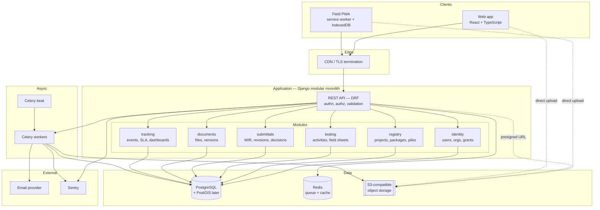
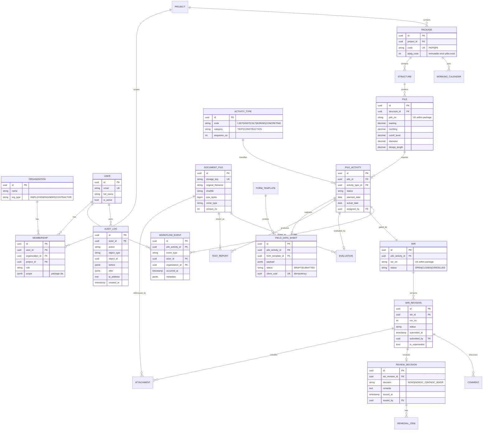
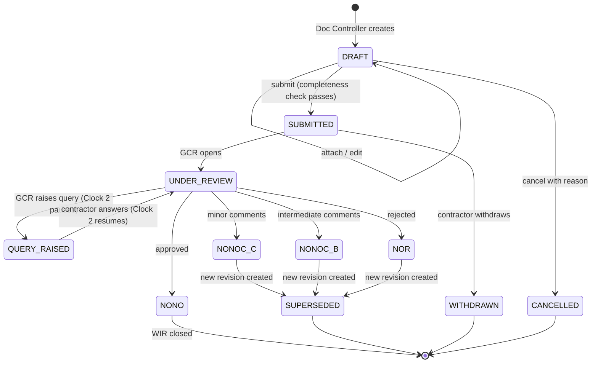
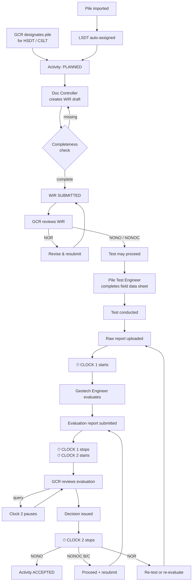
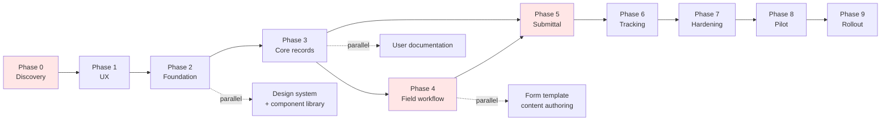

# Software Development Planning Document
## Bored Pile Testing Management Tool — South Commuter Railway Project (Packages 4, 5, 6)

**Version:** 0.1 (Draft for requirements workshop)
**Status:** Pre-development. No source code to be written against this document until Decision Gate G1 is passed (see §17).
**Prepared for:** HDDAJV pile testing and geotechnical team

---

## How to read this document

Three labels are used throughout, and they mean different things:

| Label | Meaning |
|---|---|
| **[FACT]** | Explicitly stated in the supplied project brief. Treat as confirmed. |
| **[ASSUMPTION Ann]** | Provisional. The plan proceeds on this basis, but it is unverified and may be wrong. Each has a validation owner and deadline. |
| **[RECOMMENDATION]** | An engineering or product judgement, with the reasoning stated so it can be argued with. |

Open questions are numbered **Q1–Q18** and consolidated in §21. Assumptions are numbered **A1–A16** and consolidated in §2.7. Risks are **R1–R22** in §19.

---

# 1. Executive Summary

## 1.1 The problem

On SCRP Packages 4–6, every bored pile integrity test — LSDT on 100% of piles, HSDT on 10%, CSLT on 3% **[FACT]** — must be preceded by a Work Inspection Request that carries five categories of supporting document, and followed by a two-stage evaluation and review chain that crosses an organisational boundary from HDDAJV to GCR **[FACT]**.

Today this runs on paper field data sheets, manually assembled PDF attachment packs, and email or a general-purpose document system. That produces four costs:

1. **Assembly labour.** Each WIR requires manually locating the correct revision of a working drawing, the right borelog, the key plan, the bored pile record, and cube results — for a specific pile, out of thousands.
2. **Rejection churn.** Incomplete or wrong-revision attachments cause NOR or NONOC outcomes that are administrative, not technical. Every one costs a full review cycle.
3. **No turnaround visibility.** Nobody can currently answer "how long is evaluation taking?" or "how many reviews are overdue with GCR?" without manual tallying — which means nobody argues the point in progress meetings, which means delay is invisible until it is a claim.
4. **No live compliance position.** The 100/10/3% quotas are contractual. Answering "are we compliant right now, and which piles are the gap?" currently requires assembling a spreadsheet by hand.

## 1.2 Users and stakeholders

**[FACT]** Three organisations: DOTr (Employer), GCR (Engineer/Supervisor), HDDAJV (Contractor).

Primary users are HDDAJV's Pile Test Engineers and Geotechnical Engineers, plus HDDAJV Document Control. GCR reviewers are essential *secondary* users — the system fails without them, but they are the hardest to onboard because they have no contractual obligation to use a contractor's tool (see R3, §19).

## 1.3 The proposed solution

A web application with a tablet-optimised field capture mode that:

- Holds a registry of bored piles per package, imported from as-built survey data
- Records which piles GCR has designated for HSDT and CSLT
- Captures field data digitally at the pile head, tolerating loss of connectivity
- Assembles the WIR attachment pack automatically from linked records
- Tracks each test through raw report → evaluation → GCR decision, with two independently-measured turnaround clocks
- Reports live coverage against the 100/10/3% quotas
- Preserves an immutable history of every submission, revision, comment and decision

## 1.4 Recommended MVP

Deliberately narrower than the supplied requirements list. **One package, LSDT workflow only, one pier group of piles, five to eight users.** Full detail in §3.1.

The single most important MVP design decision: **the tool prepares and tracks submittals; it does not replace the contractual submittal channel.** See A4 and §1.7.

## 1.5 Recommended technical direction

**Django + Django REST Framework + PostgreSQL, deployed as a modular monolith in containers on a managed platform, with an installable Progressive Web App for field capture.** Files in S3-compatible object storage, accessed by presigned URL. Full comparison and alternatives in §7.

## 1.6 Recommended development approach

**Lean prototype-first, then balanced MVP** (§17.1). A discovery-and-spike phase resolves the highest-cost unknowns *before* any application code, then a deliberately thin end-to-end slice reaches real users early, then the workflow broadens.

## 1.7 The most important risks and decisions

| # | Item | Why it dominates |
|---|---|---|
| **1** | Is a contractual DMS (e.g. Aconex) the mandated submittal channel? | If yes and no export path exists, the tool cannot be the submittal system and must be repositioned as a preparation workspace. This changes the product, not just a feature. **Must be answered before Phase 1.** |
| **2** | The 10% / 3% denominators are undefined | The compliance dashboard is the highest-value feature and cannot be built correctly without them. |
| **3** | Is the Geotechnical Engineer HDDAJV-internal or a third party? | Determines whether evaluation is an internal step or a second organisational boundary with its own submittal, clock, and permission set. Structural, not configurable. |
| **4** | GCR adoption | The tool measures GCR's own turnaround. Reviewers may reasonably decline. Mitigation in R3. |
| **5** | Offline field capture complexity | The single longest and least predictable engineering task. Recommendation in §22.7. |
| **6** | Solo part-time resourcing vs. scope | The scope as originally requested needs 2.5–3 FTE for 6–8 months. See §18. |

---

# 2. Project Understanding and Product Vision

## 2.1 Understanding of the tool

The brief describes it as a "centralized digital workspace." That framing understates it. Read against the actual workflow, this is **a multi-party workflow and compliance system with document management attached** — not a document repository with workflow attached. The distinction matters because it determines what gets built first.

Evidence for that reading, all from the brief **[FACT]**:

- The WIR is a *gate*, not a folder — no test may proceed without it
- The status set (NONO / NONOC C / NONOC B / NOR) is a decision outcome with different downstream consequences, not a tag
- The two SLA clocks measure a *handoff between parties*
- The test frequencies are contractual obligations with numeric thresholds

A document repository does not need any of that. A workflow system needs all of it.

## 2.2 Product vision

> **Every bored pile on Packages 4–6 has one live, complete, and defensible record — assembled once, visible to everyone entitled to see it, and provably on time.**

Three words in that sentence carry weight:

- **Assembled once** — data is captured at source (the pile head) and reused, never re-keyed into a second form
- **Complete** — the system knows what a valid WIR pack requires and refuses to submit without it
- **Defensible** — the history is immutable, so the record is usable as evidence in a claim

## 2.3 Operational problems addressed

| Problem | Current cost | Addressed by |
|---|---|---|
| Manual WIR pack assembly | 20–60 min per WIR **[ASSUMPTION A14]** | Auto-assembly from linked records |
| Attachment completeness errors | Avoidable NOR/NONOC cycles | Pre-submission validation checklist |
| Paper field sheets re-typed into reports | Double handling, transcription error | Digital field data sheet as the source record |
| Turnaround invisible | Delay undetected until it is a claim | Two SLA clocks, derived from an event log |
| Compliance position unknown | Manual spreadsheet reconciliation | Live coverage dashboard vs. 100/10/3% |
| Record retrieval for a given pile | Minutes to hours of searching | Single pile page with full chain |

## 2.4 Expected benefits by stakeholder

**HDDAJV (Contractor)** — Reduced administrative labour per test; fewer avoidable rejections; evidence of GCR review duration when programme delay is disputed; a defensible test record for handover.

**Pile Test Engineers** — No paper, no re-typing, no returning to site because a sheet was incomplete. Validation catches errors while still standing at the pile.

**Geotechnical Engineers** — Raw data and its full context arrive together. Evaluation backlog and ageing are visible, so workload can be planned rather than discovered.

**GCR (Engineer)** — A complete, correctly-versioned pack every time; a queue view of what awaits decision; fewer resubmission cycles caused by contractor-side administrative error. **This is the honest benefit case for GCR, and it is thinner than the contractor's.** Plan accordingly (R3).

**DOTr (Employer)** — Programme-level assurance on test coverage. **[ASSUMPTION A5]** No direct system access during MVP; served by periodic exported reports.

## 2.5 Measurable objectives

These are the objectives the MVP is accountable for. Baselines must be measured during Phase 0 — an objective without a baseline is unfalsifiable.

| Obj | Objective | Target | Baseline source |
|---|---|---|---|
| O1 | Reduce WIR pack assembly time | −60% | Timed observation, Phase 0 |
| O2 | Reduce WIRs returned for administrative/attachment defects | −70% | GCR register review, Phase 0 |
| O3 | Reduce test-to-evaluation duration | −30% median | Historical records, Phase 0 |
| O4 | Make evaluation-to-approval duration measurable | 100% of tests | Currently 0% |
| O5 | Eliminate re-keying of field data | 0 re-entry steps | Process map, Phase 0 |
| O6 | Time to retrieve a pile's full record | < 30 seconds | Timed observation, Phase 0 |
| O7 | Pilot adoption | ≥ 80% of in-scope tests logged in-system | — |

## 2.6 Assumptions requiring stakeholder validation

The following must be validated by interview or observation in Phase 0, not assumed into the design:

- That the field data sheet content is stable and standardised (if each engineer keeps a personal variant, form templating becomes essential rather than optional)
- That WIR numbering is issued by HDDAJV document control and not by GCR
- That "Isolated Key Plan" is a produced artefact rather than an extract from working drawings — this determines whether the system stores it or generates it
- That compressive strength results are available at the time of PIT (the brief says "if applicable", which implies they sometimes are not) **[Q7]**
- That a single Geotechnical Engineer evaluates, rather than a panel or a countersigned pair

## 2.7 Assumption register

| ID | Assumption | Confidence | Validate by | If wrong |
|---|---|---|---|---|
| **A1** | Quota denominator = total bored piles per contract package; assessed cumulatively; counted on *accepted* tests | Low | Phase 0 | Compliance engine logic changes; the feature is unbuildable until resolved |
| **A2** | Geotechnical Engineer is HDDAJV-side (staff or subconsultant) | Medium | Phase 0 | Adds a third org boundary, a third clock, and a separate permission set |
| **A3** | SLA in working days, PH public holidays, clock pauses when awaiting the other party | Low | Phase 0 | Clock computation rewrite; low code cost, high credibility cost if wrong |
| **A4** | A contractual DMS remains the formal submittal channel; this tool prepares and tracks | Medium | **Before Phase 1** | Product repositioning — see Gate G1 |
| **A5** | DOTr has no direct MVP access | High | Phase 1 | Adds an external-org read-only role and its security review |
| **A6** | Single contract, single tenant for MVP | High | Phase 1 | Multi-tenancy is expensive to retrofit — see §22.10 |
| **A7** | Field devices are Android tablets/phones; site connectivity intermittent | Medium | Phase 0 site visit | iOS support or full-offline requirement changes PWA scope |
| **A8** | Pile IDs are unique within a package and already exist in HDDAJV's numbering | High | Phase 0 | Requires a synthetic key and an alias table |
| **A9** | WIR numbers are externally assigned by document control | Medium | Phase 0 | System must generate and reserve numbers |
| **A10** | PDF is the accepted attachment format; ≤ 50 MB per file | Medium | Phase 0 | Storage and preview handling changes |
| **A11** | Raw PIT/PDA/CSL data are proprietary binary files, stored as opaque blobs in MVP | High | Phase 1 | Parsing becomes an MVP requirement (large scope increase) |
| **A12** | English is the MVP working language | Medium | Phase 0 | i18n moves from V1 to MVP; affects all UI work |
| **A13** | The spatial map is a product thesis, not a stated requirement — V1, not MVP | Medium | **Phase 0** | If the map is the reason anyone adopts it, MVP scope must include it |
| **A14** | Current WIR assembly takes 20–60 min | Low | Phase 0 timing | O1 target invalid |
| **A15** | Test volumes: ≤ 3,000 piles per package; ≤ 30 tests/day peak | Medium | Phase 0 | Sizing and NFRs change |
| **A16** | No integration with HDDAJV enterprise identity in MVP | Medium | Phase 1 | Adds SSO work |

---

# 3. Scope Definition

## 3.1 Essential MVP capabilities

Scope rule applied: **an MVP capability must be required to complete one LSDT test end-to-end, or required to keep the record defensible.** Everything else waits.

| # | Capability | Why essential |
|---|---|---|
| M-1 | Email/password auth, admin-created accounts, org + project membership | Nothing works without identity, and roles cross organisations |
| M-2 | Package → structure → pile registry, with CSV/XLSX import | The spine. Every record hangs off a pile. |
| M-3 | Test assignment (LSDT auto to all; HSDT/CSLT designated by GCR) | The obligation must exist before the evidence |
| M-4 | WIR creation with attachment slots and completeness validation | The WIR is the contractual gate |
| M-5 | Digital field data sheet, one template, tablet-optimised, draft-safe | The headline user-facing feature |
| M-6 | Raw test report upload | Starts Clock 1 |
| M-7 | Evaluation report upload and submission | Stops Clock 1, starts Clock 2 |
| M-8 | GCR decision: NONO / NONOC C / NONOC B / NOR, with comments | Stops Clock 2 |
| M-9 | Revision chain and resubmission | NONOC mandates resubmission **[FACT]** — not optional |
| M-10 | Immutable workflow event log | Everything else derives from it; unbuildable later |
| M-11 | Two SLA clocks with working-day calendar | Explicit brief requirement **[FACT]** |
| M-12 | Status dashboard + coverage-against-quota dashboard | Explicit brief requirement **[FACT]** |
| M-13 | Pile detail page showing the full chain | Delivers O6 |
| M-14 | Basic search and filter (pile no., WIR no., status, date, method) | Unusable at scale without it |
| M-15 | Audit log | Non-negotiable for a record with contractual weight |
| M-16 | Backup with a *tested* restore | See R12 |

## 3.2 Recommended Version 1 (after MVP validation)

| # | Capability | Why deferred |
|---|---|---|
| V-1 | Offline-capable field capture (full sync queue) | Genuinely hard; validate the form first with online-only or draft-on-device (§22.7) |
| V-2 | HSDT and CSLT workflows | Same skeleton as LSDT; add once the skeleton is proven |
| V-3 | Notifications and escalations (email) | Valuable, but users tolerate a dashboard first |
| V-4 | Auto-assembled WIR packs from linked records | Depends on construction records existing |
| V-5 | Export package for the contractual DMS | Required if A4 holds — promote to MVP if Gate G1 confirms it |
| V-6 | Granular per-document-type upload scoping | MVP can use coarser roles |
| V-7 | Fine-grained document version control | MVP uses revision chains at WIR level |
| V-8 | **2D spatial map with PRS92/PPCS plotting** | See A13 and §22.4 |
| V-9 | PDF report generation (evaluation report, coverage report) | Manual export acceptable initially |
| V-10 | Archival and restore | Nothing is old enough to archive during a pilot |

## 3.3 Future or optional

Bored pile *construction* records (boring, cage, concreting) as structured measurements including the concrete overbreak curve; activity dependency graph and ITP hold points; PIT/PDA/CSL raw-data parsing and curve rendering; multi-tenancy and sale to other contractors; enterprise SSO; SMS notifications; electronic signatures; native mobile apps; superstructure scope; analytics and ML on test outcomes.

## 3.4 Explicitly out of scope for now

- **Being the contractual system of record** (until A4 is resolved — see Gate G1)
- Financial, payment, or quantity-surveying functions
- Programme/schedule integration (P6, MS Project)
- Anything for the superstructure
- Design calculation or structural analysis
- Replacing the survey workflow — the system consumes survey output, it does not produce it

## 3.5 Modules not in the original list but recommended

| Module | Why needed |
|---|---|
| **Reference data administration** | Activity types, document types, form templates, holiday calendars must be editable without a code release |
| **Import and reconciliation** | Bulk pile import will need dry-run, error reporting, and re-import without duplication — this is a real module, not a script |
| **Data quality dashboard** | Piles missing coordinates, orphaned tests, WIRs with no attachments. Cheap to build, surfaces problems early |
| **Delegation / out-of-office** | A single named reviewer on leave stalls the workflow. Real operational need |
| **Saved views** | Each role has 2–3 queries they run daily. Trivial to build, disproportionate adoption effect |
| **Export service** | See V-5. Required by A4 |

---

# 4. Stakeholders, User Roles, and Permissions

## 4.1 Roles

| Role | Org | Responsibilities | Primary goal |
|---|---|---|---|
| **System Administrator** | HDDAJV / vendor | Accounts, reference data, config | Keep it running |
| **Document Controller** | HDDAJV | WIR numbering, pack assembly, submission | Zero rejected-on-admin submittals |
| **Pile Test Engineer** | HDDAJV | Field data sheets, conduct tests, raw reports | Complete a test without returning to site |
| **Geotechnical Engineer** | HDDAJV **[A2]** | Evaluate raw data, produce evaluation reports | Clear the backlog with defensible reports |
| **QA/QC Manager** | HDDAJV | Oversight, compliance position | No contractual non-compliance |
| **GCR Reviewer** | GCR | Review, comment, issue decisions | Decide quickly with complete information |
| **GCR Administrator** | GCR | Designate HSDT/CSLT piles; manage GCR users | Correct test population |
| **DOTr Observer** | DOTr | Programme assurance | **[A5]** Deferred past MVP |

## 4.2 RBAC matrix

`C` create · `R` read · `U` update · `S` submit · `A` approve/decide · `X` export · `—` no access

| Record | SysAdmin | Doc Controller | Pile Test Eng | Geotech Eng | QA/QC Mgr | GCR Reviewer | GCR Admin |
|---|---|---|---|---|---|---|---|
| Users & roles | CRU | — | — | — | R | — | CRU *(GCR users)* |
| Reference data | CRU | R | R | R | R | R | R |
| Pile registry | CRU | CRU | R | R | R | R | R |
| Test assignment | R | R | R | R | R | R | **CRU** |
| Field data sheet | R | R | **CRUS** | R | R | R | R |
| Raw test report | R | R | **CUS** | R | R | R | R |
| Evaluation report | R | R | R | **CUS** | R | R | R |
| WIR (draft) | R | **CRU** | CR | CR | R | — | — |
| WIR (submitted) | R | RS | R | R | R | R | R |
| GCR decision | R | R | R | R | R | **CA** | R |
| Comments | R | CR | CR | CR | CR | CR | CR |
| Dashboards | R | R | R | R | R | R | R |
| Audit log | R | R | — | — | R | R | R |
| Exports | X | X | X | X | X | X | X |
| Delete | **none** | none | none | none | none | none | none |

**Note the last row.** Nothing is hard-deleted (§9.6). "Delete" in the UI means void-with-reason, which is an audit event.

## 4.3 Separation of duties

Four constraints that must be enforced server-side, not merely hidden in the UI:

1. **A Pile Test Engineer cannot evaluate a test they executed.** Prevents self-verification.
2. **A Geotechnical Engineer cannot issue a GCR decision.** Prevents the contractor approving its own submittal — the single most important control in the system.
3. **No user may hold both GCR Reviewer and any HDDAJV role** on the same project.
4. **An issued WIR revision is immutable.** Corrections create a new revision.

## 4.4 GCR and cross-organisation access

This is the structurally hardest part of the permission model, and it is why a simple Admin ⊃ Player hierarchy fails: **GCR holds write permissions HDDAJV does not have (decisions, test designation), and HDDAJV holds write permissions GCR does not have (submissions, field data).** These are disjoint sets on shared objects.

**[RECOMMENDATION]** Model as explicit `(role, action, object_type, scope)` grants, evaluated server-side on every request, with `scope` resolving to a project or package. Do not use Django's default model-level permissions alone — they cannot express "GCR may decide, but only on submitted WIRs in packages they are assigned to."

## 4.5 DOTr access

**[RECOMMENDATION]** No direct access during MVP. Serve DOTr with a periodic exported coverage and turnaround report. Rationale: DOTr is the Employer, and giving the Employer live visibility of the Contractor's internal in-progress data before it is formally submitted creates a commercial exposure that HDDAJV should decide on deliberately, not inherit as a default. **[Q12]**

---

# 5. Functional Requirements

Requirements are specified in full template form for the ten most critical MVP capabilities. The remainder are given in compact form (§5.11) — **[RECOMMENDATION]** writing full templates for all forty before requirements workshops is wasted effort, because the workshops will change them.

Priority: **P1** blocks pilot · **P2** needed for a usable pilot · **P3** improves the pilot.

---

### FR-01 · Bulk Pile Registry Import

| | |
|---|---|
| **Purpose** | Populate the pile registry from as-built survey or setting-out data without manual entry |
| **Primary user** | Document Controller |
| **Preconditions** | Project and package exist; user has create rights on the package |
| **Inputs** | CSV or XLSX with pile no., structure/pier ref., easting, northing, elevation, diameter, design length, source CRS |
| **Main process** | Upload → parse → validate → **dry-run preview showing creates, updates, and errors** → user confirms → commit in a single transaction |
| **Outputs** | Created/updated pile records; downloadable error report; audit entry |
| **Business rules** | Pile no. unique within package **[A8]**. Coordinates stored in the package's declared CRS with the EPSG code recorded on the row. Re-import updates by pile no. and never duplicates. |
| **Exceptions** | Missing required column → reject whole file. Bad row → reported, other rows still importable. Coordinate outside package bounding box → warning, not error. Duplicate pile no. within the file → reject. |
| **Dependencies** | FR-02 |
| **Priority / MVP** | P1 / MVP |
| **Acceptance criteria** | Given a 500-row file with 3 bad rows, the preview lists exactly those 3 with row numbers and reasons; confirming imports 497; re-importing the corrected file results in 500 total, not 1,000. |

---

### FR-02 · Project, Package and Structure Management

| | |
|---|---|
| **Purpose** | Provide the containment hierarchy every record hangs from |
| **Primary user** | System Administrator |
| **Preconditions** | Authenticated admin |
| **Inputs** | Project name; package code (P4/P5/P6); structure/pier reference; declared CRS (EPSG); working-day calendar |
| **Main process** | Create/edit; assign memberships |
| **Outputs** | Hierarchy available for selection everywhere |
| **Business rules** | Every pile belongs to exactly one structure; every structure to one package; one package to one project. CRS is set at package level and cannot be changed once piles exist. |
| **Exceptions** | Attempt to change CRS with piles present → blocked with explanation |
| **Dependencies** | — |
| **Priority / MVP** | P1 / MVP |
| **Acceptance criteria** | A pile cannot be created without a structure; changing package CRS after import is refused. |

---

### FR-03 · Test Assignment and Designation

| | |
|---|---|
| **Purpose** | Record the obligation to test a pile, before any test data exists |
| **Primary user** | GCR Administrator |
| **Preconditions** | Piles imported |
| **Inputs** | Method (LSDT/HSDT/CSLT); pile selection (individual, multi-select, or CSV of pile IDs) |
| **Main process** | LSDT auto-assigned to every pile on creation. HSDT and CSLT assigned explicitly by GCR **[FACT]**. Each assignment starts in `PLANNED`. |
| **Outputs** | `PileActivity` records; coverage dashboard updates |
| **Business rules** | Only GCR Administrator may designate HSDT/CSLT. One active assignment per (pile, method). Assignment cannot be deleted once a test has been executed against it — it may be `CANCELLED` with reason. |
| **Exceptions** | Assigning a method to a pile that already has an active one → reject with link to existing |
| **Dependencies** | FR-01 |
| **Priority / MVP** | P1 / MVP |
| **Acceptance criteria** | Importing 100 piles creates 100 LSDT assignments and zero HSDT/CSLT; a GCR Admin designating 10 for HSDT moves the dashboard from 0% to 10%. |

---

### FR-04 · Compliance Coverage Dashboard

| | |
|---|---|
| **Purpose** | Answer "are we compliant right now, and which piles are the gap?" |
| **Primary user** | QA/QC Manager; GCR Reviewer |
| **Preconditions** | Assignments exist |
| **Inputs** | Package filter; date-as-of |
| **Main process** | For each method, compute planned / executed / evaluated / accepted counts against the required quota **[A1]**; list the gap piles |
| **Outputs** | Per-method progress display; drillable gap list; CSV export |
| **Business rules** | **[A1]** Denominator = total piles in package. Quota measured on *accepted* (NONO) tests. Required counts round **up**. |
| **Exceptions** | If the package has zero piles, show "no data", not 0% |
| **Dependencies** | FR-01, FR-03, FR-08 |
| **Priority / MVP** | P1 / MVP |
| **Acceptance criteria** | For 1,000 piles: required LSDT 1,000, HSDT 100, CSLT 30. With 40 accepted HSDT the dashboard shows 40/100 and lists the 60 designated-but-not-accepted piles. **Rounding and denominator must be reconfigurable without a code change, pending Q1.** |

---

### FR-05 · Digital Field Data Sheet

| | |
|---|---|
| **Purpose** | Replace the paper field sheet at the point of test |
| **Primary user** | Pile Test Engineer |
| **Preconditions** | Assignment exists in `WIR_APPROVED` state; user assigned to package |
| **Inputs** | Template-defined fields; pile identification; date/time; equipment ID; operator; test-specific readings; photos; optional GPS |
| **Main process** | Select pile → form renders from active template version → autosave draft locally every change → validate → submit |
| **Outputs** | `FieldDataSheet` linked to the assignment; workflow event `FIELD_DATA_CAPTURED` |
| **Business rules** | Rendered from a **versioned template**; a submitted sheet is permanently bound to its template version. Drafts are private to the author; submitted sheets are immutable and correctable only by a new version with reason. Device GPS is stored as corroboration only and never overwrites survey coordinates. |
| **Exceptions** | Connection lost → draft retained on device, submit retried. Required field missing → submission blocked with the field highlighted. Duplicate submit → idempotent on client-generated UUID. |
| **Dependencies** | FR-02, FR-03, FR-13 |
| **Priority / MVP** | P1 / MVP |
| **Acceptance criteria** | An engineer completes a sheet, loses connectivity mid-form, closes the browser, reopens 30 minutes later and finds the draft intact; submitting once connectivity returns creates exactly one sheet. |

---

### FR-06 · WIR Preparation, Validation and Submission

| | |
|---|---|
| **Purpose** | Assemble and submit a complete, valid inspection request |
| **Primary user** | Document Controller |
| **Preconditions** | Assignment exists |
| **Inputs** | WIR number **[A9]**; assignment; proposed test date; attachments in five categories **[FACT]**: working drawings, geotechnical borelog with SPT, isolated key plan, bored pile records, compressive strength results (if applicable) |
| **Main process** | Create draft → attach → **completeness check** → submit → GCR notified |
| **Outputs** | `WIRRevision` in `SUBMITTED`; event `WIR_SUBMITTED` |
| **Business rules** | Submission blocked unless every mandatory category has ≥1 attachment. "If applicable" categories require an explicit justified waiver, not silent omission **[Q7]**. On submission the revision becomes immutable. |
| **Exceptions** | Missing category → blocked, listing what is missing. Duplicate WIR number in package → rejected. |
| **Dependencies** | FR-03, FR-07 |
| **Priority / MVP** | P1 / MVP |
| **Acceptance criteria** | A WIR missing the key plan cannot be submitted, and the error names the missing category. After submission, editing any field is refused. |

---

### FR-07 · Attachment Upload and Storage

| | |
|---|---|
| **Purpose** | Store supporting documents safely and cheaply |
| **Primary user** | All contractor roles |
| **Preconditions** | Parent record exists in an editable state |
| **Inputs** | File (PDF primary **[A10]**), document category, optional revision reference |
| **Main process** | Client requests presigned upload URL → uploads direct to object storage → confirms to API → metadata row created → background virus scan and checksum |
| **Outputs** | `DocumentFile` with SHA-256 checksum, size, MIME type, uploader, timestamp |
| **Business rules** | Files never pass through the application server. Storage key is opaque (UUID), never user-supplied. Content type validated by magic bytes, not extension. Max 50 MB **[A10]**. Files are immutable — replacement creates a new version. |
| **Exceptions** | Failed scan → quarantined, uploader notified, not attachable. Oversized → rejected before upload starts. Orphaned uploads reaped after 24h. |
| **Dependencies** | FR-06 |
| **Priority / MVP** | P1 / MVP |
| **Acceptance criteria** | A renamed `.exe` is rejected. A 60 MB file is rejected before bytes transfer. Download of a file the user lacks rights to returns 403 and is audit-logged. |

---

### FR-08 · GCR Review and Decision

| | |
|---|---|
| **Purpose** | Record the Engineer's formal determination |
| **Primary user** | GCR Reviewer |
| **Preconditions** | Evaluation submitted; reviewer assigned to package |
| **Inputs** | Decision (NONO / NONOC C / NONOC B / NOR) **[FACT]**; remarks; list of remedial/outstanding items; optional annotated attachment |
| **Main process** | Open queue item → review → select decision → enter remarks → confirm → clock stops, parties notified |
| **Outputs** | `ReviewDecision`; revision status set; event `DECISION_ISSUED` |
| **Business rules** | Only GCR Reviewer may decide. Cannot decide on a submittal from their own organisation (§4.3). NONOC C and NONOC B both permit proceeding **and both require resubmission** **[FACT]**. NOR does not permit proceeding. Remedial items are **mandatory** for NONOC and NOR. A decision is immutable once issued. |
| **Exceptions** | NONOC/NOR with empty remedial list → blocked. Decision on an already-decided revision → rejected. |
| **Dependencies** | FR-09, FR-10 |
| **Priority / MVP** | P1 / MVP |
| **Acceptance criteria** | Issuing NONOC B without remedial items is refused; issuing it with items sets the revision status, stops Clock 2, and creates exactly one immutable decision record. |

---

### FR-09 · Revision Chain and Resubmission

| | |
|---|---|
| **Purpose** | Preserve full history across the NONOC/NOR resubmission cycle |
| **Primary user** | Document Controller |
| **Preconditions** | A decision of NONOC C, NONOC B or NOR exists |
| **Inputs** | Response to each remedial item; revised/added attachments |
| **Main process** | Create Rev N+1, pre-populated from Rev N → address items → submit → Rev N marked `SUPERSEDED` |
| **Outputs** | New revision; prior revisions retained in full |
| **Business rules** | Only one non-superseded revision per WIR. Superseded revisions and their attachments are never deleted or altered. Each revision carries its own decision and its own Clock 2. A cumulative across-revisions duration is also retained. |
| **Exceptions** | Creating a revision on a NONO-closed WIR → blocked |
| **Dependencies** | FR-06, FR-08 |
| **Priority / MVP** | P1 / MVP |
| **Acceptance criteria** | After Rev 0 → NOR → Rev 1 → NONOC B → Rev 2 → NONO, all three revisions with their attachments and decisions remain retrievable, and both per-revision and cumulative durations are reported. |

---

### FR-10 · SLA Clock Computation

| | |
|---|---|
| **Purpose** | Measure the two durations the brief requires **[FACT]** |
| **Primary user** | QA/QC Manager |
| **Preconditions** | Workflow events exist |
| **Inputs** | Event log; package working-day calendar |
| **Main process** | **Clock 1** starts at `RAW_REPORT_UPLOADED`, stops at `EVALUATION_SUBMITTED`. **Clock 2** starts at `EVALUATION_SUBMITTED`, stops at `DECISION_ISSUED`. Pause on `QUERY_RAISED`, resume on `QUERY_ANSWERED` **[A3]**. |
| **Outputs** | Elapsed working days; overdue flag; ageing buckets |
| **Business rules** | **Durations are always derived from the event log, never stored.** Working days per package calendar **[A3]**. Target thresholds are configuration, not code. |
| **Exceptions** | Out-of-order or missing events → item flagged for data-quality review, not silently defaulted |
| **Dependencies** | FR-14 |
| **Priority / MVP** | P1 / MVP |
| **Acceptance criteria** | A test with raw report Fri 17:00, evaluation Tue 09:00, one public holiday Monday, reports Clock 1 = 1 working day. Changing the calendar and recomputing changes historical figures consistently. |

---

## 5.11 Remaining functional requirements (compact)

| ID | Requirement | Primary user | Priority | MVP? |
|---|---|---|---|---|
| FR-11 | Authentication, session management, password reset | All | P1 | MVP |
| FR-12 | Account administration and membership assignment | SysAdmin | P1 | MVP |
| FR-13 | Field data sheet template administration (versioned) | SysAdmin | P1 | MVP |
| FR-14 | Immutable workflow event log | System | P1 | MVP |
| FR-15 | Audit log with actor, action, before/after, IP | System | P1 | MVP |
| FR-16 | Raw test report upload (starts Clock 1) | Pile Test Eng | P1 | MVP |
| FR-17 | Evaluation report submission (stops Clock 1) | Geotech Eng | P1 | MVP |
| FR-18 | Pile detail page with full record chain | All | P1 | MVP |
| FR-19 | Search and filter across piles, WIRs, tests | All | P1 | MVP |
| FR-20 | Role dashboards (§11.3) | All | P1 | MVP |
| FR-21 | CSV export of any list view | All | P2 | MVP |
| FR-22 | Comment threads on WIRs and evaluations | All | P2 | MVP |
| FR-23 | Data quality dashboard | QA/QC | P2 | MVP |
| FR-24 | Saved views / filters | All | P3 | MVP |
| FR-25 | Working-day calendar administration | SysAdmin | P1 | MVP |
| FR-26 | Email notifications on state transitions | All | P2 | V1 |
| FR-27 | Overdue escalation rules | QA/QC | P2 | V1 |
| FR-28 | Offline field capture with sync queue | Pile Test Eng | P1 | V1 |
| FR-29 | HSDT and CSLT workflows | Pile Test Eng | P1 | V1 |
| FR-30 | Query raise/answer (clock pause) | GCR | P2 | V1 |
| FR-31 | PDF generation of evaluation report | Geotech Eng | P2 | V1 |
| FR-32 | PDF generation of coverage report | QA/QC | P2 | V1 |
| FR-33 | Export package for contractual DMS | Doc Controller | P1 | V1 *(MVP if Gate G1 confirms A4)* |
| FR-34 | Delegation / out-of-office | All | P3 | V1 |
| FR-35 | Document version control (per-file) | Doc Controller | P3 | V1 |
| FR-36 | Archival and restore | SysAdmin | P3 | V1 |
| FR-37 | 2D spatial map with PRS92/PPCS plotting | All | P3 | V1 **[A13]** |
| FR-38 | Bulk operations (multi-assign, multi-export) | Doc Controller | P3 | V1 |
| FR-39 | Enterprise SSO | All | P3 | Future |
| FR-40 | Raw test data parsing and curve rendering | Geotech Eng | P3 | Future |

---

# 6. Non-Functional Requirements

Specified as measurable targets. Anything unmeasurable has been removed rather than stated as an aspiration.

## 6.1 MVP-essential

| Area | Requirement |
|---|---|
| **Performance** | P95 page load < 2.5 s on 4G; P95 API read < 500 ms; list endpoints paginated at 50; pile search returning from 3,000 piles < 1 s; field sheet renders < 1.5 s on a mid-range Android tablet |
| **Availability** | 99% during PH working hours (07:00–19:00 Mon–Sat). Overnight maintenance windows acceptable. **No high-availability requirement in MVP** — it is not worth the cost at this user count |
| **Reliability** | Zero data loss on submitted records. Idempotent submission via client-generated UUIDs. Failed background jobs retried 3× then alerted |
| **Scalability** | 3,000 piles/package, 10,000 total records, 50 concurrent users, 30 test submissions/day **[A15]**. Single application instance sufficient |
| **Data integrity** | FK constraints enforced at DB level, not only in application code. All state transitions in transactions. Checksums on every stored file. Submitted records immutable |
| **Security** | TLS 1.2+ everywhere; passwords Argon2id; server-side authorisation on every endpoint; presigned URLs expiring ≤ 15 min; OWASP Top 10 addressed (§13) |
| **Privacy** | Personal data limited to name, work email, org, role. No location tracking of individuals — GPS captured per *test*, not per *person* |
| **Auditability** | Every create/update/state-change/download/permission-change logged with actor, timestamp, IP, before/after. Log append-only and not editable through the application |
| **Mobile usability** | Field sheet usable one-handed on a 10" tablet in daylight; touch targets ≥ 44 px; works in landscape and portrait; **usable while wearing thin gloves** |
| **Browser support** | Current and previous major versions of Chrome, Edge, Safari; Chrome on Android 10+. **No IE11** |
| **File upload** | ≤ 50 MB/file, ≤ 200 MB/WIR; PDF, JPEG, PNG, plus declared raw-data extensions |
| **Backup** | Nightly full DB backup, 30-day retention, PITR ≥ 7 days; object storage versioning on. **A restore rehearsed and documented before pilot** |
| **Connectivity** | Field sheet must survive connection loss without data loss: local draft persistence, explicit offline indicator, retry on reconnect (see §22.7 for the offline decision) |
| **Monitoring** | Uptime check, error tracking, DB and disk alerts, background queue depth alert |

## 6.2 Strengthen after MVP

| Area | Later target |
|---|---|
| Availability | 99.5%; multi-AZ database |
| Performance | P95 API < 250 ms; vector tiles for map at 50k+ features |
| Disaster recovery | Documented RPO ≤ 1 h, RTO ≤ 4 h, tested twice yearly |
| Accessibility | WCAG 2.1 AA (MVP: keyboard navigation, sufficient contrast, labelled inputs — a defensible subset) |
| Security | Third-party penetration test before wide rollout; malware scanning on upload; secrets rotation |
| Retention | Formal policy aligned to the contract's document retention clause **[Q15]** |
| Scalability | 50k+ piles, multi-package, read replicas |
| Extensibility | Documented module seams for construction-records scope |

## 6.3 Two NFRs worth arguing about

**[RECOMMENDATION] Do not target 99.9% availability for the MVP.** It roughly triples infrastructure cost and adds operational complexity for a system used by fewer than fifty people during working hours. 99% with a rehearsed restore is the honest engineering answer, and the effort saved is better spent on the field data sheet.

**[RECOMMENDATION] Treat auditability as a functional requirement, not a non-functional one.** On a project where records may become evidence in a claim, an incomplete audit trail is a product defect, not a quality shortfall. It should have acceptance criteria and tests like any feature.


---

# 7. Recommended Technology Stack

## 7.1 How these choices were made

Three criteria dominated, in this order:

1. **Can a very small team maintain it?** This project will likely be built and operated by one to three people. A stack requiring four specialisms is a liability regardless of technical merit.
2. **Does it reduce the risk of the hardest parts?** The hard parts are workflow correctness, permissions, and offline field capture — not throughput.
3. **Is it reversible?** Prefer choices that can be replaced later without rewriting the domain logic.

Deliberately *not* prioritised: raw performance, fashionable architecture, and horizontal scalability. At 50 concurrent users these are irrelevant, and optimising for them is the most common way small projects die.

## 7.2 Major choices with alternatives

### Backend framework

| | |
|---|---|
| **Role** | Business logic, workflow state machine, permissions, API |
| **Recommended** | **Django 5 + Django REST Framework (Python)** |
| **Why it fits** | Batteries-included admin (free reference-data management, saving weeks), mature migrations, the strongest permission and audit ecosystem of any full-stack framework, and a straight path to GeoDjango/PostGIS if the map (FR-37) is built. Python also owns the PDF and geospatial libraries this domain needs. |
| **Alternative 1** | **NestJS (Node/TypeScript)** — one language across the stack, better for shared types with the frontend. But you build the admin yourself, and the ORM story (TypeORM/Prisma) is weaker for complex permissions. |
| **Alternative 2** | **Laravel (PHP)** — comparable productivity, excellent ecosystem, cheaper hosting. Weaker fit for geospatial and scientific data handling. |
| **Trade-offs** | Django: fastest to a working system for a small team, very mature, low lock-in, huge ecosystem. Slower raw throughput than Node — irrelevant here. Requires Python experience. |
| **MVP?** | Required |

### Web frontend

| | |
|---|---|
| **Role** | Dashboards, WIR management, review queues, admin screens |
| **Recommended** | **React 18 + TypeScript + Vite**, with TanStack Query for server state and Tailwind for styling |
| **Why it fits** | Largest hiring pool; TypeScript catches whole classes of error in a permission-heavy UI; TanStack Query removes most caching and refetch bugs from dashboards that must reflect state changes made by other organisations. |
| **Alternative 1** | **Django templates + HTMX** — dramatically less code, no separate build, no API contract to maintain. **Genuinely worth considering** for a solo developer; the main cost is that the offline field capture then needs a separate implementation anyway. |
| **Alternative 2** | **Vue 3 + Nuxt** — comparable; smaller ecosystem locally. |
| **Trade-offs** | React: more initial setup and more code than HTMX, but one codebase serves both desktop and the PWA field mode. |
| **MVP?** | Required |

### Field capture approach

| | |
|---|---|
| **Role** | Data entry at the pile head, tolerating poor connectivity |
| **Recommended** | **Installable Progressive Web App** — same React codebase, service worker, IndexedDB draft persistence |
| **Why it fits** | One codebase, no app-store review cycle (critical when the form changes mid-project), and no per-device provisioning. Modern PWAs handle camera, geolocation and offline storage adequately. |
| **Alternative 1** | **React Native / Flutter native app** — better offline and device integration, but a second codebase, a second build pipeline, and app-store distribution friction on a contractor-managed device fleet. |
| **Alternative 2** | **Responsive web only, no offline** — cheapest by far. Viable if a Phase 0 site survey finds connectivity is adequate. See §22.7. |
| **Trade-offs** | PWA: much cheaper than native, weaker on iOS (background sync limits, storage eviction). Confirm device fleet under A7. |
| **MVP?** | PWA shell required; full offline sync recommended for V1 |

### API style

| | |
|---|---|
| **Role** | Contract between clients and backend |
| **Recommended** | **REST over HTTPS, JSON**, versioned at `/api/v1/`, OpenAPI schema generated from code |
| **Why it fits** | Simple, cacheable, universally understood, and trivially debuggable — which matters when a field engineer reports a sync failure. |
| **Alternative 1** | **GraphQL** — flexible querying, but authorisation on a graph is materially harder to get right, and this system's core risk is authorisation. **Not recommended.** |
| **Alternative 2** | **tRPC** — excellent type safety, but couples to a TypeScript backend. |
| **MVP?** | Required |

### Database

| | |
|---|---|
| **Role** | System of record for all structured data |
| **Recommended** | **PostgreSQL 16** (add the **PostGIS** extension when FR-37 is built) |
| **Why it fits** | Strong constraints and transactional guarantees — essential when a record has contractual weight. JSONB handles versioned form templates without a second database. PostGIS is the only credible option for the map, and enabling it later is a single migration. |
| **Alternative 1** | **MySQL/MariaDB** — adequate, but weaker JSON, weaker constraint support, and no realistic geospatial path. |
| **Alternative 2** | **MongoDB** — **actively wrong here.** This domain is highly relational and integrity-critical. |
| **MVP?** | Required |

### File and object storage

| | |
|---|---|
| **Role** | PDF attachments and raw test data |
| **Recommended** | **S3-compatible object storage** (AWS S3, or **Cloudflare R2** for zero egress fees), presigned URL upload/download, versioning enabled |
| **Why it fits** | Files never transit the app server, so a 50 MB upload costs no application memory. Versioning gives immutability nearly free. |
| **Alternative 1** | **Local/attached volume** — simplest, but backup, versioning and durability become your problem. Not recommended beyond local development. |
| **Alternative 2** | **Azure Blob / Google Cloud Storage** — equivalent; choose by hosting alignment. |
| **MVP?** | Required |

### Authentication and authorisation

| | |
|---|---|
| **Role** | Identity, sessions, and the permission model |
| **Recommended** | **django-allauth** (identity) + **a custom grant-based authorisation layer** (§4.4), enforced by DRF permission classes and queryset scoping |
| **Why it fits** | Identity is commodity; authorisation is domain-specific and cannot be outsourced. Cross-org disjoint permission sets are not expressible in any off-the-shelf role library without customisation anyway. |
| **Alternative 1** | **Auth0 / Clerk** — offloads identity, MFA and SSO. Worth revisiting when enterprise SSO (FR-39) is needed. Adds cost and an external dependency in MVP. |
| **Alternative 2** | **django-guardian** (object-level permissions) — useful, but per-object rows scale badly. Prefer scope-based rules. |
| **MVP?** | Required |

### Background jobs

| | |
|---|---|
| **Role** | Virus scanning, checksums, notifications, exports, report generation |
| **Recommended** | **Celery + Redis** |
| **Why it fits** | Standard in the Django ecosystem, well-documented, adequate at this scale. |
| **Alternative 1** | **django-q2 / Huey** — lighter, fewer moving parts. **A reasonable MVP choice if you want one less service to operate.** |
| **Alternative 2** | **Managed queue (SQS)** — less operational burden, more lock-in. |
| **MVP?** | Required (a lighter option is acceptable) |

### Remaining components

| Component | Recommended | Alternative | MVP? |
|---|---|---|---|
| **Notifications** | Transactional email via Postmark or SES | SMS via Twilio/Semaphore (PH) — later | V1 |
| **Search** | PostgreSQL full-text + trigram indexes | Elasticsearch/Meilisearch — unjustified below ~100k records | MVP (Postgres) |
| **PDF generation** | WeasyPrint (HTML → PDF) | ReportLab (programmatic, more control, more code) | V1 |
| **Caching** | Redis (shared with Celery) | Django local-memory cache | MVP (minimal) |
| **Hosting** | **Railway or Fly.io** for MVP → AWS/Azure at scale | Bare VPS (cheapest, most ops work); Kubernetes (**over-engineering at this scale**) | MVP |
| **Containerisation** | Docker + Docker Compose | Nix, buildpacks | MVP |
| **CI/CD** | GitHub Actions | GitLab CI, CircleCI | MVP |
| **Monitoring** | Sentry (errors) + Better Stack/UptimeRobot (uptime) | Datadog, Grafana Cloud — later | MVP |
| **Testing** | pytest + pytest-django + factory_boy; Playwright for E2E | unittest; Cypress | MVP |
| **Analytics** | Plausible or self-hosted PostHog | GA4 — **avoid**, given data sensitivity | V1 |

## 7.3 Recommended stack summary

| Layer | Selection | MVP |
|---|---|---|
| Web frontend | React 18 + TypeScript + Vite + Tailwind + TanStack Query | ✅ |
| Field capture | Same codebase as installable PWA; IndexedDB drafts | ✅ (shell) |
| Backend | Django 5 + Django REST Framework | ✅ |
| API | REST/JSON, `/api/v1/`, OpenAPI generated | ✅ |
| Database | PostgreSQL 16 (+ PostGIS when FR-37 lands) | ✅ |
| Object storage | S3-compatible (Cloudflare R2 or AWS S3), versioned | ✅ |
| Auth | django-allauth + custom grant-based authorisation | ✅ |
| Background jobs | Celery + Redis | ✅ |
| Email | Postmark or Amazon SES | V1 |
| Search | PostgreSQL FTS + pg_trgm | ✅ |
| PDF | WeasyPrint | V1 |
| Hosting | Railway / Fly.io → AWS later | ✅ |
| Containers | Docker + Compose | ✅ |
| CI/CD | GitHub Actions | ✅ |
| Monitoring | Sentry + uptime check | ✅ |
| Testing | pytest, factory_boy, Playwright | ✅ |

**Estimated MVP infrastructure cost: USD 60–150/month.** Not a meaningful constraint; developer time is the only real cost here.

---

# 8. Software Architecture

## 8.1 Recommended approach: modular monolith

**[RECOMMENDATION] A modular monolith, containerised, with explicitly enforced module boundaries.**

Reasoning:

- **Microservices are wrong here.** They solve organisational scaling (independent teams deploying independently). With one to three developers there is no such problem, and the cost — distributed transactions across a workflow that must be transactionally correct, network failure modes, N deployment pipelines, distributed tracing — is paid immediately for a benefit that arrives, if ever, in years.
- **Serverless is a poor fit.** Cold starts hurt an interactive workflow app; long-lived DB connections are awkward; and local development becomes materially harder.
- **An unstructured monolith is the real risk.** The failure mode is not "we chose a monolith", it is "we chose a monolith and let every module import every other module." Boundaries must be enforced, not merely intended.

**Boundary enforcement mechanism:** each module exposes a `services.py` public interface; cross-module imports of models or internals are forbidden and checked in CI by an import-linter rule. This is the single practice that keeps future extraction cheap.

## 8.2 High-level architecture



## 8.3 Module responsibilities and boundaries

| Module | Owns | Must not |
|---|---|---|
| **identity** | Users, organisations, memberships, permission grants | Know about piles or WIRs |
| **registry** | Projects, packages, structures, piles, CRS, import | Know about tests or documents |
| **testing** | `PileActivity`, field data sheets, templates, raw reports | Issue decisions |
| **submittals** | WIR, revisions, attachment linkage, decisions, comments | Own file bytes |
| **documents** | File metadata, storage keys, checksums, versions | Know why a file exists |
| **tracking** | Workflow events, SLA computation, dashboards, audit | Mutate any other module's state |

**Note the dependency direction:** `tracking` reads events but never writes domain state. This is what makes SLA logic safe to change without risking workflow correctness.

## 8.4 Frontend-to-backend communication

REST/JSON over HTTPS. Session cookies (`HttpOnly`, `Secure`, `SameSite=Lax`) for the web app; the PWA uses the same session with a documented refresh path. **[RECOMMENDATION]** Prefer cookie sessions over localStorage-held JWTs — XSS is a more realistic threat here than the scaling problems JWTs solve, and revocation matters when a user leaves the project.

## 8.5 Authorisation flow

Every request passes through four checks, in order:

1. **Authenticated?** → 401
2. **Member of the target project/package?** → 404 (not 403 — do not leak the existence of records to non-members)
3. **Does the role hold the required `(action, object_type)` grant?** → 403
4. **Does the object's current state permit the action?** (e.g. cannot edit a submitted WIR) → 409

Every list query is scoped at the queryset level by membership, so a missing check fails closed rather than exposing data.

## 8.6 File handling

Upload: client requests a presigned PUT → uploads direct to object storage → confirms to API → metadata row created → Celery job computes checksum, scans, generates preview.
Download: API checks authorisation → issues a presigned GET valid ≤ 15 min → logs the access.
Versioning: object storage versioning plus an application-level version chain. **Bytes are never overwritten.**

## 8.7 Deployment and scaling

**MVP:** one web container, one worker container, managed Postgres, managed Redis, object storage. Single region (Singapore or Manila for latency **[Q13]**).

**Scaling path, in the order pressure will actually arrive:**

1. Vertical database scaling — takes you further than expected
2. Multiple web replicas behind the platform load balancer (app is stateless)
3. Read replica for dashboards and reports
4. Extract Celery workers into separately-scaled pools
5. CDN and vector tiles if FR-37 grows
6. **Only then** consider extracting a service — and the first candidate is document processing, because it is bursty and CPU-bound

## 8.8 When to change the architecture

Change only on evidence of one of these:

- More than three developers regularly blocked on each other's deployments
- One module's resource profile is genuinely incompatible with the rest
- A regulatory or contractual requirement forces physical data separation
- Sustained load that vertical scaling and read replicas cannot meet

**None of these will be true during MVP or V1.** Revisit at the point of multi-tenancy.

---

# 9. Data Architecture and Initial Database Design

## 9.1 Entity-relationship diagram



## 9.2 Key schema decisions

**UUID primary keys throughout.** Enables client-generated IDs for offline capture (essential for FR-05 idempotency) and avoids leaking record counts.

**`PILE_ACTIVITY` is the generalisation of test assignment.** `ACTIVITY_TYPE` is a table, not an enum, so adding boring, cage installation and concreting later requires seed data rather than a migration and a refactor of every downstream table. **This is the single most valuable forward-looking decision in the schema, and it costs nothing today.**

**`FIELD_DATA_SHEET.payload` is JSONB, rendered by `FORM_TEMPLATE`.** The field sheet will change during the project. Templating avoids a code release per change, and binding a submission to its template version keeps old sheets renderable.

**`WORKFLOW_EVENT` is append-only and is the source of all durations.** Never store an elapsed time. When someone disputes a figure eighteen months later, you replay the derivation.

## 9.3 Indexes and constraints

| Type | Detail |
|---|---|
| Unique | `PILE(structure→package, pile_no)`; `WIR(package, wir_no)`; `WIR_REVISION(wir_id, rev_no)`; `FIELD_DATA_SHEET(client_uuid)`; `DOCUMENT_FILE(storage_key)` |
| Partial unique | One non-superseded revision per WIR: `UNIQUE(wir_id) WHERE is_superseded = false` |
| Foreign keys | All enforced at DB level with `ON DELETE RESTRICT` |
| Check | `REVIEW_DECISION.decision IN (...)`; `WIR_REVISION.rev_no >= 0` |
| Performance | `WORKFLOW_EVENT(pile_activity_id, occurred_at)`; `PILE_ACTIVITY(status, activity_type_id)`; `WIR_REVISION(status, submitted_at)`; trigram index on `PILE.pile_no` and `WIR.wir_no` |
| Spatial | GiST on `PILE.geometry` — only when FR-37 is built |
| Audit fields | Every table: `created_at`, `created_by`, `updated_at`, `updated_by` |

## 9.4 Files stored separately from metadata

`DOCUMENT_FILE` holds metadata and an opaque `storage_key`; bytes live in object storage. This gives cheap storage, no application memory pressure on large uploads, native versioning and lifecycle rules, and the ability to migrate storage providers without touching the database.

## 9.5 History and version preservation

Three complementary mechanisms:

1. **Revision chains** — `WIR_REVISION` for submittals; `version_no` for files
2. **Event log** — `WORKFLOW_EVENT` for state history
3. **Audit log** — `AUDIT_LOG` with before/after for field-level changes

## 9.6 Data that must never be overwritten

- Any submitted `WIR_REVISION` and its attachments
- Any issued `REVIEW_DECISION`
- Any submitted `FIELD_DATA_SHEET`
- Every `WORKFLOW_EVENT` and `AUDIT_LOG` row
- File bytes in object storage

**[RECOMMENDATION]** Enforce with database triggers rejecting `UPDATE`/`DELETE` on these tables, not only with application logic. Application code changes; a trigger is a guarantee. Use a dedicated application DB role without `DELETE` on audit tables.

## 9.7 Migration and import strategy

| Source | Approach |
|---|---|
| Pile coordinates | CSV/XLSX import with dry-run (FR-01) — the primary path |
| Historical WIR register | One-off import, marked `legacy=true`, statuses only, no SLA computation |
| Historical PDFs | **Do not bulk migrate.** Import on demand when a pile is next touched |
| Paper field sheets | **Do not migrate.** Historical data goes forward as scanned attachments |

**[RECOMMENDATION]** Resist migrating historical data. It is the most common cause of MVP delay, and the value is far lower than it appears — the tool's value is in *new* work. Set a cutover date and start clean.

---

# 10. Workflow and State-Machine Design

## 10.1 WIR revision state machine



**Critical business rule from the brief [FACT]:** NONOC C and NONOC B both permit proceeding to the next stage of works **and both require resubmission of the WIR**. NOR does not permit proceeding. The difference between C and B is comment severity and required response urgency — **[Q6]** confirm whether B carries a shorter response deadline, since that would make it an SLA rule rather than a label.

## 10.2 End-to-end test workflow



## 10.3 Workflow specifications

| Workflow | Responsible | Valid statuses | Prohibited actions | SLA effect | Notification | Audit entry |
|---|---|---|---|---|---|---|
| WIR preparation | Doc Controller | DRAFT → SUBMITTED | Submitting incomplete; editing after submit | none | GCR on submit | `WIR_CREATED`, `WIR_SUBMITTED` |
| Attachment validation | System | pass / fail | Bypassing the check | none | uploader on scan failure | `ATTACHMENT_ADDED` |
| Test scheduling | GCR Admin | PLANNED → SCHEDULED | Non-GCR designating HSDT/CSLT | none | contractor | `ACTIVITY_ASSIGNED` |
| Field data capture | Pile Test Eng | DRAFT → SUBMITTED | Editing a submitted sheet | none | geotech eng | `FIELD_DATA_CAPTURED` |
| Raw report upload | Pile Test Eng | — | Uploading before test date | **starts Clock 1** | geotech eng | `RAW_REPORT_UPLOADED` |
| Evaluation | Geotech Eng | DRAFT → SUBMITTED | Evaluating own executed test | **stops C1, starts C2** | GCR | `EVALUATION_SUBMITTED` |
| GCR review | GCR Reviewer | UNDER_REVIEW → decision | Deciding on own org's submittal; NONOC/NOR without remedial items | **stops Clock 2** | contractor | `DECISION_ISSUED` |
| Query | GCR Reviewer | QUERY_RAISED | — | **pauses Clock 2** | contractor | `QUERY_RAISED` / `QUERY_ANSWERED` |
| Resubmission | Doc Controller | new revision | Revising a NONO-closed WIR | new Clock 2 | GCR | `REVISION_CREATED` |
| Closure | System | ACCEPTED | Reopening a closed activity | — | all | `ACTIVITY_ACCEPTED` |

## 10.4 SLA event definitions

| Event | Effect | Rule |
|---|---|---|
| `RAW_REPORT_UPLOADED` | Clock 1 start | First upload only; re-uploads do not restart |
| `EVALUATION_SUBMITTED` | Clock 1 stop, Clock 2 start | First submission of the current revision |
| `QUERY_RAISED` | Clock 2 pause | **[A3]** |
| `QUERY_ANSWERED` | Clock 2 resume | **[A3]** |
| `DECISION_ISSUED` | Clock 2 stop | Any of the four decisions |
| `REVISION_CREATED` | New Clock 2 begins on resubmission | Cumulative also retained |
| Threshold breach | Overdue flag | Computed, not stored **[Q5]** |

## 10.5 Rules stakeholders must confirm

**Q4** Are SLA targets defined contractually? If so, what are they?
**Q5** What are the overdue thresholds for Clock 1 and Clock 2?
**Q6** Does NONOC B carry a shorter response deadline than NONOC C?
**Q3** Does the clock pause on query? *(Provisional: yes, per A3)*
**Q8** May a test proceed on NONOC before resubmission is decided? *(The brief says yes for the next stage of works; confirm this extends to test execution.)*
**Q9** Who may withdraw a submitted WIR, and does withdrawal stop the clock?

---

# 11. User Experience and Interface Planning

## 11.1 Information architecture

```
Project → Package (P4/P5/P6)
  ├── Dashboard          role-specific landing
  ├── Piles              registry, search, detail
  ├── Tests              activities by method and status
  ├── WIRs               submittal register
  ├── Reviews            GCR queue
  ├── Reports            coverage, turnaround, exports
  └── Admin              users, templates, calendars, reference data
```

**[RECOMMENDATION]** Package is the primary navigation context, not project. Users work within one package all day; forcing a two-level selection on every screen is friction for no benefit.

## 11.2 Main screens (MVP)

| Screen | Purpose |
|---|---|
| Login / package selection | Entry; remembers last package |
| Role dashboard | The one screen each role lands on |
| Pile register | Searchable table; status chips per method |
| **Pile detail** | The most important read screen — full chain, top to bottom |
| Test activity list | Filter by method, status, date, overdue |
| **Field data sheet (tablet)** | The most important write screen |
| WIR register | All submittals with revision and status |
| WIR detail | Attachments, completeness, revision history, decisions |
| **GCR review queue** | Sorted by ageing; the screen that determines GCR adoption |
| Decision form | Decision, remarks, remedial items |
| Coverage dashboard | 100/10/3% position with drillable gaps |
| Turnaround dashboard | Clock 1 and Clock 2 distributions and overdue list |
| Admin screens | Users, templates, calendars, reference data |

## 11.3 Dashboards by role

**Pile Test Engineer** — My assigned tests today · drafts awaiting submission · tests blocked pending WIR approval · sync status
**Geotechnical Engineer** — Evaluation queue by ageing · overdue evaluations · recently returned by GCR
**Document Controller** — WIRs in draft · incomplete packs · awaiting GCR · resubmissions due
**GCR Reviewer** — Awaiting my decision, oldest first · queries outstanding · decided this week
**QA/QC Manager** — Coverage vs 100/10/3% · Clock 1 and Clock 2 medians · overdue count · NOR rate trend

## 11.4 Field workflow (tablet)

Designed against actual conditions: bright sun, gloves, one hand occupied, unreliable signal.

1. Open PWA → offline-capable pile list already cached
2. Search or scan pile → **large touch targets, minimal typing**
3. Form renders section by section; progress indicator
4. **Autosave on every field change to local storage**
5. Photos captured inline, compressed client-side
6. Validation runs on-device before submission is offered
7. Submit → queued if offline, with explicit "3 pending" indicator
8. Sync on reconnect → confirmation

**Non-negotiable design constraints:** never lose entered data on navigation, backgrounding, or connection loss; never show a blocking spinner without a cancel path; always show connectivity and pending-sync state; never silently discard a queued submission.

## 11.5 Draft, validation and interruption handling

| Situation | Behaviour |
|---|---|
| Partially complete form | Saved as draft automatically; resumable on any device once synced |
| Connection lost mid-form | Draft persists locally; banner appears; entry continues uninterrupted |
| Validation failure | Inline, at the field, on blur — not a modal at the end |
| Submit while offline | Queued; explicit pending count; auto-retry with backoff |
| Same sheet edited on two devices | Last write wins **with a conflict warning**; both versions retained **[Q10]** |
| Session expires mid-form | Draft preserved; re-authenticate and continue |

## 11.6 Finding records quickly

Global search bar accepting pile number, WIR number, or structure reference, with type-ahead. Every list filterable by status, method, date range, assignee and overdue flag; every filter set saveable (FR-24) and URL-encoded so it can be shared in a message.

## 11.7 Accessibility

**[RECOMMENDATION]** Full WCAG 2.1 AA is not a realistic MVP target for a small team. Commit instead to a defensible subset: keyboard navigation on all interactive elements, 4.5:1 contrast minimum, labelled form inputs, visible focus states, no colour-only status encoding (relevant to the NONO/NONOC/NOR chips — pair colour with text). Full AA audit at V1.

---

# 12. Document and Records Management

## 12.1 Categories, naming and metadata

**Categories (MVP):** Working Drawing · Geotechnical Borelog with SPT · Isolated Key Plan · Bored Pile Record · Compressive Strength Test Result · Raw Test Data · Evaluation Report · Correspondence/Other **[FACT, from the WIR attachment list]**

**[RECOMMENDATION] Do not enforce filename conventions.** Store the original filename for traceability and derive display names from metadata. Filename conventions are enforced by humans, fail constantly, and the metadata makes them redundant.

**Mandatory metadata:** category, parent record, uploader, upload timestamp, checksum, size, MIME type, version. **Optional:** source revision reference, date of original document, remarks.

## 12.2 Organisation and control

Virtual organisation only — files are located by their relationship to a pile, activity or WIR, never by folder path. There are no folders to misfile into.

| Control | MVP | Later |
|---|---|---|
| File-type allowlist (magic-byte checked) | ✅ | |
| Size limits (50 MB file / 200 MB WIR) | ✅ | |
| Checksums on every file | ✅ | |
| Immutability of submitted attachments | ✅ | |
| Revision chains at WIR level | ✅ | |
| Approval timestamps on decisions | ✅ | |
| Download permission checks + logging | ✅ | |
| Malware scanning | ✅ (basic) | full engine |
| Per-file version control | | V1 |
| Watermarking on download | | V1 — see below |
| Electronic signatures | | Future **[Q11]** |
| Retention and archival policy | | V1 **[Q15]** |
| Restore from archive | | V1 |

**[RECOMMENDATION] Watermarking is worth more than it appears.** Stamping downloaded PDFs with recipient, timestamp and "uncontrolled copy" addresses the most common document-control failure on construction projects — a superseded drawing circulating as if current. Cheap to add at V1.

## 12.3 Traceability

Every document is reachable from the pile, and the pile is reachable from every document:

```
PILE → PILE_ACTIVITY → WIR → WIR_REVISION → ATTACHMENT → DOCUMENT_FILE
                     → FIELD_DATA_SHEET
                     → TEST_REPORT → DOCUMENT_FILE
                     → EVALUATION → DOCUMENT_FILE
                     → REVIEW_DECISION → REMEDIAL_ITEM
                     → WORKFLOW_EVENT (full history)
```

This is what delivers objective O6 — the complete record of a pile retrieved in under 30 seconds.


---

# 13. Security and Data Protection

## 13.1 Sensitive data and threats

| Asset | Sensitivity | Primary threat |
|---|---|---|
| Test results and evaluations | **High** — commercially and contractually consequential | Tampering; premature disclosure to the Employer |
| Borelogs and as-built data | High — proprietary project data | Exfiltration |
| Review decisions and timestamps | **High** — potential claim evidence | Tampering; repudiation |
| User accounts | Medium | Credential theft, privilege escalation |
| Personal data | Low — name, work email, role | Standard data protection obligations |
| Pile coordinates | Medium — infrastructure alignment data | Exfiltration |

The threat that matters most is not an external attacker. It is **a legitimate internal user altering or backdating a record** whose timestamp has commercial value. That is what the immutability and audit design in §9.6 exists to prevent, and it should be described to stakeholders in exactly those terms.

## 13.2 Controls

**Authentication (MVP):** Argon2id password hashing; minimum 12 characters checked against a breached-password list; rate limiting with progressive backoff; 12-hour session expiry with 30-day "remember this device"; secure cookie flags; forced logout on role change. **MFA for GCR Reviewer and System Administrator accounts is recommended for V1**, since these hold decision and configuration authority.

**Authorisation:** the four-stage check in §8.5; queryset-level scoping on every list; deny-by-default; **automated permission tests as a required CI gate** (§15).

**Encryption:** TLS 1.2+ in transit with HSTS; AES-256 at rest for database and object storage (provider-managed keys are adequate at MVP); presigned URLs expiring ≤ 15 minutes; secrets in the platform's secret manager, never in the repository.

**File upload safety:** allowlist by magic bytes not extension; size caps enforced pre-upload; opaque UUID storage keys; files served only via presigned URL with an authorisation check; uploads quarantined until scanned; PDFs rendered in a sandboxed viewer.

**Web vulnerabilities:** Django ORM (SQL injection); React escaping plus a strict Content Security Policy (XSS); framework CSRF tokens; UUID keys plus object-level checks (IDOR); rate limits (brute force); dependency scanning in CI plus Dependabot; strict server-side validation of all input.

## 13.3 Backup, recovery and retention

Nightly full database backup with 30-day retention; point-in-time recovery ≥ 7 days; object storage versioning with lifecycle rules; monthly restore rehearsal into a scratch environment with the result recorded.

**[RECOMMENDATION] A backup that has never been restored is not a backup.** Rehearse the restore before pilot, and treat "restore rehearsed and documented" as an exit criterion for Phase 7, not a nice-to-have.

## 13.4 Legal and compliance — requires specialist confirmation

**[RECOMMENDATION] The following need confirmation by HDDAJV's legal or contracts team, not by the development team.**

| Item | Question |
|---|---|
| **Philippine Data Privacy Act (RA 10173)** | Registration obligations; does the processing scale trigger a Data Protection Officer requirement? **[Q14]** |
| **Data residency** | Does the contract or DOTr policy require PH-hosted data? **[Q13]** — this constrains hosting region and must be resolved before infrastructure is provisioned |
| **Contract confidentiality clauses** | May project data be hosted on third-party infrastructure controlled by a developer? **[Q16]** |
| **Document retention** | What retention period does the contract impose? **[Q15]** |
| **Employer data rights** | Does DOTr have contractual right of access to this data? Affects A5 |
| **Evidentiary weight** | If records may be used in a claim, are there requirements on record integrity or signature? **[Q11]** |

**[RECOMMENDATION] Use synthetic data for all development and demonstration until Q16 is answered in writing.** This is a genuine and immediate constraint, not a formality.

---

# 14. API and Integration Planning

## 14.1 Style and conventions

REST/JSON, versioned at `/api/v1/`, OpenAPI 3 schema generated from code (drf-spectacular). Rationale in §7.2 — the decisive factor is that authorisation on a GraphQL graph is materially harder to get right, and authorisation is this system's core risk.

**Conventions:**

- **Validation errors** — `422` with a field-keyed error object; **state errors** — `409` with the current state and permitted transitions
- **Pagination** — cursor-based, default 50, max 200
- **Filtering** — declared query parameters only, never arbitrary field access
- **Idempotency** — `Idempotency-Key` header on all mutating endpoints; client-generated UUIDs for offline submissions
- **Uploads** — presigned URL flow only; no multipart through the API
- **Versioning** — URL path; additive changes only within a version; 6-month deprecation notice

## 14.2 Conceptual resources

```
/auth/{login,logout,session,password-reset}
/projects/{id}/packages
/packages/{id}/{piles,activities,wirs,coverage,calendar}
/piles/{id}                        full record chain
/piles/import                      dry-run + commit
/activities/{id}/{field-sheet,reports,evaluation}
/wirs/{id}/revisions
/wir-revisions/{id}/{attachments,decision,comments}
/documents/upload-url              presigned PUT
/documents/{id}/download-url       presigned GET, authorised, logged
/form-templates/{id}
/events?activity_id=               workflow event log (read-only)
/dashboards/{coverage,turnaround}
/exports/{coverage,turnaround,register}
```

## 14.3 Integrations

| Integration | Purpose | MVP? | Risk / fallback |
|---|---|---|---|
| Transactional email | Notifications | V1 | Provider outage → dashboard remains authoritative; queue and retry |
| **Contractual DMS export** | Formal submittal | **V1, or MVP if Gate G1 confirms A4** | No API → generate a ZIP with a manifest for manual upload |
| Enterprise identity (SSO) | Single sign-on | Future | Local accounts remain as fallback |
| SMS (Semaphore/Twilio) | Urgent escalation | Future | Email fallback |
| Object storage | File persistence | MVP | Provider lock-in low; S3 API is portable |
| Error tracking | Operations | MVP | Degrades to application logs |
| Document signing | E-signatures | Future | Wet signature on exported PDF |

**[RECOMMENDATION] Design the DMS export as a file-based package from day one**, even if an API later becomes available. A ZIP with a manifest works against every DMS ever built, requires no vendor cooperation, and cannot be broken by the vendor's roadmap.

---

# 15. Testing and Quality Assurance

## 15.1 Strategy

**[RECOMMENDATION] Test coverage should be concentrated, not uniform.** A blanket coverage target produces tests for CRUD scaffolding while leaving the state machine untested. Concentrate effort where a defect is expensive:

| Priority | Area | Approach | Target |
|---|---|---|---|
| **Critical** | Workflow state transitions | Exhaustive unit tests over every valid and invalid transition | 100% of transitions |
| **Critical** | Permissions | Matrix test: every role × every endpoint × allowed/denied | 100% of §4.2 |
| **Critical** | SLA computation | Unit tests incl. weekends, holidays, pauses, resubmissions | 100% of branches |
| **Critical** | Separation of duties | Explicit tests for each of the four §4.3 rules | 100% |
| High | Import and validation | Integration tests on real-shaped files | ~90% |
| High | File upload and access control | Integration incl. negative cases | ~90% |
| High | Offline sync and idempotency | Simulated interruption tests | ~85% |
| Medium | Dashboards and aggregation | Integration on seeded data | ~70% |
| Medium | CRUD | Standard | ~60% |
| Low | Static UI | Smoke only | — |

## 15.2 Test layers

Unit (pytest, isolated logic) · Integration (DRF test client, DB, real transactions) · API contract (OpenAPI schema conformance) · Database (constraint and trigger enforcement — verify immutability triggers actually reject) · E2E (Playwright, ~10 critical journeys only) · Device (manual on the actual field tablet, in daylight) · Accessibility (axe-core in CI) · Performance (k6 against P95 targets, before pilot) · Security (dependency scan in CI; OWASP ZAP baseline; pen test before wide rollout) · Backup/restore (monthly rehearsal, recorded) · UAT (§17 Phase 7).

## 15.3 Example acceptance criteria

**Scenario: NONOC B resubmission preserves history**
> Given WIR-0042 Rev 0 submitted 01 Mar with four attachments
> And GCR issued NONOC B on 05 Mar with two remedial items
> When Doc Controller creates Rev 1 and submits on 07 Mar
> Then Rev 0 is `SUPERSEDED` with all four attachments intact and its decision retrievable
> And Rev 1 is the only non-superseded revision
> And Clock 2 for Rev 1 starts fresh at 07 Mar
> And cumulative duration across revisions is reported separately
> And the event log contains `DECISION_ISSUED` and `REVISION_CREATED` in order

**Scenario: Separation of duties on evaluation**
> Given engineer Ramos executed the test on pile P4-12-03
> When Ramos attempts to submit the evaluation for that test
> Then the request is refused with 403
> And the attempt is written to the audit log

**Scenario: Offline field sheet survives interruption**
> Given a Pile Test Engineer has completed 8 of 12 fields
> When the device loses connectivity and the browser is closed
> And the app is reopened 30 minutes later
> Then all 8 field values are present
> And on reconnect, submitting creates exactly one field data sheet

**Scenario: Working-day SLA across a holiday**
> Given raw report uploaded Friday 17:00
> And Monday is a Philippine public holiday
> When evaluation is submitted Tuesday 09:00
> Then Clock 1 reports 1 working day

---

# 16. DevOps, Environments, and Operations

## 16.1 Environments

| Env | Purpose | Data | Deploy |
|---|---|---|---|
| Local | Development | Synthetic seed | Docker Compose |
| CI | Automated tests | Ephemeral | Per push |
| Staging | UAT, demos, rehearsals | Anonymised or synthetic | Auto from `main` |
| Production | Live | Real | Manual promotion, tagged |

**[RECOMMENDATION] Three environments, not five.** A small team cannot maintain five, and stale environments are worse than absent ones.

## 16.2 Practices

**Git:** trunk-based on `main` with short-lived branches; PR required; one reviewer (or self-review against a written checklist if solo); conventional commits; tagged releases.

**CI (GitHub Actions), on every PR:** lint (ruff, eslint) → type check (mypy, tsc) → unit tests → integration tests → **import-linter module boundary check** (§8.1) → dependency vulnerability scan → build container. Merge blocked on any failure.

**CD:** merge to `main` → deploy to staging automatically → smoke tests → manual promotion to production → post-deploy health check → automatic rollback on failure.

**Migrations:** forward-only; every migration must be backward-compatible with the previous application version (expand-migrate-contract); destructive changes split across releases; **rehearse every migration against a production-sized copy** before release.

**Secrets:** platform secret manager; never in the repo; separate credentials per environment; rotate on personnel change; `.env.example` documents required variables without values.

**Monitoring and alerting:** Sentry for errors; uptime check every 60 s; alerts on error-rate spike, P95 latency breach, queue depth, disk > 80%, failed backup, failed scheduled job. **[RECOMMENDATION]** Alert on *failed backup jobs* specifically — it is the most commonly missed alert and the most expensive to miss.

**Releases:** weekly cadence during development; no Friday deploys; hotfix path documented; rollback by redeploying the previous tag; database rollback via PITR (accepted as slow and rare).

**Incident response:** severity definitions (S1 data loss or total outage; S2 workflow blocked; S3 degraded; S4 cosmetic); a single named on-call owner; user-facing status communication; blameless post-mortem for S1/S2.

**Operational documentation (before pilot):** runbook (deploy, rollback, restore, common failures), architecture decision records, user guides per role, onboarding guide, support contact and hours.


---

# 17. Recommended Software Development Phasing

## 17.1 Comparison of three approaches

### Approach A — Lean prototype-first

Build the narrowest possible slice (one workflow, one package, LSDT only) and put it in front of real users within weeks.

**Advantages:** fastest validation of the riskiest assumption (will engineers actually use a digital field sheet at the pile head?); cheapest failure; real feedback shapes everything downstream; sustains morale on a long project.
**Disadvantages:** foundation work deferred, so some rework is certain; a prototype shown to stakeholders creates pressure to "just ship it"; audit and permission foundations are hard to retrofit.
**Cost/time:** lowest — 8–12 weeks to something usable.
**Risks:** technical debt if the prototype is promoted to production without hardening; under-built audit trail on a record with contractual weight.
**Team:** 1–2 developers.
**Suitable when:** user adoption is the dominant uncertainty. **It is here.**

### Approach B — Balanced MVP

Establish auth, data model, audit and CI foundations first, then deliver one complete end-to-end workflow.

**Advantages:** foundations right the first time — critical for immutability and audit, which are genuinely painful to retrofit; the pilot runs on production-grade infrastructure; realistic path to V1 without rewrite.
**Disadvantages:** 6–10 weeks before users see anything; assumptions stay unvalidated longer; higher cost if the product premise is wrong.
**Cost/time:** moderate — 20–30 weeks to pilot.
**Risks:** building the wrong thing correctly.
**Team:** 2–3 developers plus part-time design and QA.
**Suitable when:** requirements are reasonably well understood and the record has compliance weight. **Both are partly true here.**

### Approach C — Platform-first

Build shared infrastructure, multi-tenancy, full document management and the construction-scope data model before pilot.

**Advantages:** no re-architecture when scope expands; supports selling to other contractors.
**Disadvantages:** 9–15 months before any user value; very high risk of building for imagined requirements; the construction scope is not yet specified.
**Cost/time:** highest.
**Risks:** the classic failure mode for this class of project.
**Team:** 4–6.
**Suitable when:** multi-tenant commercial intent is confirmed and funded. **Not the case today.**

## 17.2 Recommendation

**[RECOMMENDATION] A hybrid: Approach A for discovery and validation, transitioning to Approach B for build.**

Specifically: run a real Phase 0 discovery with a throwaway clickable prototype and a technical spike, then build on proper foundations (Approach B) but **sequence the field data sheet earlier than a textbook Approach B would**, so the riskiest adoption assumption is tested by week 14 rather than week 24.

The reasoning is that this project has two dominant risks pulling in opposite directions — *adoption uncertainty* argues for A, and *records with contractual weight* argues for B. A pure prototype that becomes production would leave you with an inadequate audit trail on evidentiary records. A pure Approach B would spend six months before discovering engineers prefer paper.

**Non-negotiable within the hybrid:** the audit log, event log and immutability constraints (§9.6) are built in Phase 2 and never retrofitted, even if everything else is throwaway.

## 17.3 Phase plan

### Phase 0 — Discovery and Domain Validation

| | |
|---|---|
| **Purpose** | Resolve the assumptions that would invalidate the plan, before spending on build |
| **Scope** | Stakeholder interviews, site observation, document inventory, spike |
| **Key activities** | Interview 2 pile test engineers, 1 geotech engineer, 1 doc controller, **1 GCR reviewer**; observe one full test cycle end to end; **site connectivity survey**; collect real samples of every WIR attachment type and the field sheet; confirm quota rules, SLA rules and status semantics; confirm contractual DMS position; measure baselines for O1–O6 |
| **Deliverables** | Validated process map; form inventory; **answers to Q1–Q9**; baseline measurements; connectivity report; go/no-go recommendation |
| **Dependencies** | Stakeholder availability |
| **Roles** | Product owner, BA, domain SMEs |
| **Effort** | **2–4 weeks** (elapsed; limited by stakeholder calendars, not effort) |
| **Entry** | Sponsor commitment; SME time allocated |
| **Exit** | **Gate G1** — Q1, Q2, Q3 and the DMS question answered in writing |
| **Validation** | HDDAJV QA/QC Manager and at least one GCR representative |
| **Risks** | GCR unwilling to engage (R3); stakeholder availability (R8) |
| **Do NOT build** | Anything. No code. **[RECOMMENDATION]** The temptation to "start on the data model while waiting" is how unvalidated assumptions become schema. |

### Phase 1 — Product and UX Definition

| | |
|---|---|
| **Purpose** | Decide what to build and prove the field sheet is usable before engineering it |
| **Scope** | Journeys, wireframes, clickable prototype, backlog |
| **Key activities** | User journeys per role; wireframes for the 13 MVP screens; **clickable field data sheet prototype tested on a real tablet, on site, by a real engineer**; prioritised backlog with acceptance criteria |
| **Deliverables** | Wireframes; tested prototype; prioritised backlog; success metrics agreed |
| **Dependencies** | Phase 0 |
| **Roles** | Product owner, UX, BA, SMEs |
| **Effort** | **3–4 weeks** |
| **Entry** | Gate G1 passed |
| **Exit** | Field sheet prototype completed on site by an engineer without assistance |
| **Validation** | Pile test engineers, geotech engineer, doc controller |
| **Risks** | Prototype feedback forces significant redesign (this is a *success*, not a failure) |
| **Do NOT build** | Production code; visual design polish; anything beyond MVP scope |

### Phase 2 — Technical Foundation

| | |
|---|---|
| **Purpose** | Establish the foundations that cannot be retrofitted |
| **Scope** | Repo, CI/CD, environments, auth, data model, audit and event logs |
| **Key activities** | Repository and standards; Docker Compose; GitHub Actions with the module-boundary check; staging and production provisioned; identity module; **grant-based authorisation with its full test matrix**; core schema through `PILE_ACTIVITY`; **`WORKFLOW_EVENT` and `AUDIT_LOG` with immutability triggers**; error tracking; backup configured **and a restore rehearsed** |
| **Deliverables** | Deployable skeleton in production; passing CI; permission matrix tests green; documented restore |
| **Dependencies** | Phase 1 |
| **Roles** | Lead developer, DevOps |
| **Effort** | **4–6 weeks** |
| **Entry** | Backlog agreed; hosting region confirmed (Q13) |
| **Exit** | A commit reaches production automatically via staging; restore rehearsed and documented |
| **Validation** | Technical only |
| **Risks** | Over-engineering the foundation (R6) |
| **Do NOT build** | Any business workflow; UI beyond a login page; the map; notifications |

### Phase 3 — Core Records

| | |
|---|---|
| **Purpose** | Make piles and their obligations exist in the system |
| **Scope** | FR-01, FR-02, FR-03, FR-07, FR-18, FR-19 |
| **Key activities** | Package/structure hierarchy; **pile import with dry-run**; test assignment incl. GCR designation; document upload via presigned URL; pile detail page; search and filter |
| **Deliverables** | Real package data loaded; piles searchable; assignments visible |
| **Dependencies** | Phase 2 |
| **Roles** | 1–2 developers |
| **Effort** | **4–5 weeks** |
| **Entry** | Real pile coordinate file obtained |
| **Exit** | A real package's piles imported and retrievable in < 30 s (O6 partially met) |
| **Validation** | Document controller confirms the import matches their records |
| **Risks** | Real data messier than expected (R9) — highly likely |
| **Do NOT build** | The map; construction records; bulk operations |

### Phase 4 — Field and Test Workflow

| | |
|---|---|
| **Purpose** | Replace the paper field sheet — the highest-risk adoption feature |
| **Scope** | FR-05, FR-13, FR-16 |
| **Key activities** | Versioned form templates; tablet-optimised field sheet; local draft persistence; client-side validation; photo capture; raw report upload; **field trial with a real engineer on a real pile** |
| **Deliverables** | Working field sheet in production; one real test captured digitally |
| **Dependencies** | Phase 3 |
| **Roles** | 1–2 developers, UX support |
| **Effort** | **5–7 weeks** (**widest range in the plan** — see R5) |
| **Entry** | Form template content confirmed |
| **Exit** | An engineer completes a real field sheet on site without assistance and without data loss |
| **Validation** | Pile test engineers |
| **Risks** | Offline complexity (R5); device fleet inconsistency (R11) |
| **Do NOT build** | Full offline sync queue unless Phase 0 connectivity data justifies it (§22.7); HSDT/CSLT forms |

### Phase 5 — Submittal and Review Workflow

| | |
|---|---|
| **Purpose** | Close the loop across the organisational boundary |
| **Scope** | FR-06, FR-08, FR-09, FR-17, FR-22 |
| **Key activities** | WIR creation with completeness validation; submission; evaluation upload; **GCR review queue and decision form**; revision chain and resubmission; comments; separation-of-duties enforcement |
| **Deliverables** | Complete workflow from WIR to decision |
| **Dependencies** | Phase 4 |
| **Roles** | 1–2 developers |
| **Effort** | **5–6 weeks** |
| **Entry** | GCR reviewer identified and willing to participate |
| **Exit** | One test completes the full cycle including one resubmission, with all history intact |
| **Validation** | **GCR reviewer** and document controller |
| **Risks** | **GCR non-participation (R3) — the highest-impact risk in the project** |
| **Do NOT build** | Notifications; escalation; DMS export |

### Phase 6 — Tracking and Dashboards

| | |
|---|---|
| **Purpose** | Deliver the measurement the brief asks for |
| **Scope** | FR-04, FR-10, FR-20, FR-21, FR-23, FR-25 |
| **Key activities** | SLA computation from the event log; working-day calendar admin; coverage dashboard; turnaround dashboard; role dashboards; CSV exports; data quality dashboard |
| **Deliverables** | Live compliance and turnaround position |
| **Dependencies** | Phase 5; Q1 and Q4/Q5 answered |
| **Roles** | 1–2 developers |
| **Effort** | **3–4 weeks** |
| **Entry** | Quota rules and SLA thresholds confirmed |
| **Exit** | QA/QC Manager confirms figures match a manual reconciliation |
| **Validation** | QA/QC Manager |
| **Risks** | Quota rules still unresolved (R2) → build parameterised and configure later |
| **Do NOT build** | Notifications; PDF report generation |

### Phase 7 — Hardening and UAT

| | |
|---|---|
| **Purpose** | Make it safe to use on a live project |
| **Scope** | Security, performance, permissions, data, documentation |
| **Key activities** | Security review against §13; performance testing to §6.1; **full permission matrix verification**; import rehearsal at production volume; backup and restore validation; UAT with all roles; user documentation; training |
| **Deliverables** | Signed UAT; runbook; user guides; go/no-go decision |
| **Dependencies** | Phase 6 |
| **Roles** | Full team plus all SMEs |
| **Effort** | **3–4 weeks** |
| **Entry** | Feature freeze |
| **Exit** | **Gate G3** — UAT signed; restore proven; no open S1/S2 defects |
| **Validation** | All roles including GCR |
| **Risks** | UAT surfaces workflow misunderstanding (R4) |
| **Do NOT build** | New features. **Feature freeze means feature freeze.** |

### Phase 8 — Pilot

| | |
|---|---|
| **Purpose** | Prove it in real conditions at contained risk |
| **Scope** | One package, LSDT only, one pier group, 5–8 users, 6–8 weeks |
| **Key activities** | Controlled launch; **run parallel with the existing process**; daily standup in week 1, weekly after; defect triage; measure O1–O7 |
| **Deliverables** | Pilot report against success metrics; defect log; V1 backlog |
| **Dependencies** | Phase 7 |
| **Roles** | Full team, reduced capacity, plus pilot users |
| **Effort** | **6–8 weeks elapsed**, ~40% team capacity |
| **Entry** | Gate G3 passed; pilot scope and users agreed |
| **Exit** | **Gate G4** — ≥ 80% of in-scope tests logged; no S1 defects in final 2 weeks; users prefer it to paper |
| **Validation** | All pilot users |
| **Risks** | Adoption failure (R7); parallel running fatigue |
| **Do NOT build** | New features except S1/S2 fixes. Park everything else. |

### Phase 9 — Rollout and Continuous Improvement

| | |
|---|---|
| **Purpose** | Extend to full scope and hand over to sustainable operation |
| **Scope** | Remaining packages; HSDT and CSLT; V1 backlog |
| **Key activities** | Phased rollout by package; HSDT/CSLT workflows; notifications; DMS export; offline sync if deferred; operations handover; support process; post-launch review |
| **Deliverables** | Full-scope system; support model; V1 roadmap |
| **Effort** | **Ongoing** |
| **Entry** | Gate G4 passed |
| **Risks** | Scope inflation from accumulated requests (R10) |

## 17.4 Roadmap summary

| Phase | Focus | Effort | Cumulative | Gate |
|---|---|---|---|---|
| 0 | Discovery | 2–4 w | 2–4 w | **G1** |
| 1 | UX definition | 3–4 w | 5–8 w | |
| 2 | Foundation | 4–6 w | 9–14 w | **G2** |
| 3 | Core records | 4–5 w | 13–19 w | |
| 4 | Field workflow | 5–7 w | 18–26 w | |
| 5 | Submittal & review | 5–6 w | 23–32 w | |
| 6 | Tracking | 3–4 w | 26–36 w | |
| 7 | Hardening & UAT | 3–4 w | 29–40 w | **G3** |
| 8 | Pilot | 6–8 w | 35–48 w | **G4** |
| 9 | Rollout | ongoing | | |

**Elapsed calendar time to pilot: 8–11 months at 2–3 FTE.** See §18 for what changes at other team sizes.

## 17.5 Decision gates

| Gate | After | Criteria | If failed |
|---|---|---|---|
| **G1** | Phase 0 | Q1 (quotas), Q2 (geotech employer), Q3 (SLA rules) and the DMS question answered in writing; sponsor confirmed; GCR engaged | **Stop.** Do not build on unresolved fundamentals |
| **G2** | Phase 2 | CI/CD live; permission tests green; immutability triggers verified; restore rehearsed | Fix before any feature work |
| **G3** | Phase 7 | UAT signed by all roles incl. GCR; no open S1/S2; restore proven; docs complete | Delay pilot |
| **G4** | Phase 8 | ≥80% adoption; no S1 in final 2 weeks; metrics improved; users prefer it | Extend pilot or reconsider scope |

## 17.6 Dependency map and critical path



**Critical path:** Phase 0 → Phase 1 → Phase 2 → Phase 3 → **Phase 4** → **Phase 5** → Phase 6 → Phase 7 → Phase 8.

The two red nodes are the schedule risks. **Phase 4** carries the widest effort range because offline capture is the least predictable work. **Phase 5** depends on GCR participation, which is outside the team's control.

**Can run in parallel:** design system with foundation work; user documentation with Phases 3–6; form template content authoring with Phase 3; security review preparation with Phase 6; test data preparation throughout.

**Must be sequential:** foundation before any feature; pile registry before assignments; assignments before WIRs; WIR approval before field capture; raw report before evaluation; evaluation before review; event log before any SLA computation.

## 17.7 Earliest realistic pilot

**Week 35 at the optimistic end; week 48 at the realistic end**, at 2–3 FTE.

A *demonstrable* end-to-end workflow arrives around week 26–32 (end of Phase 5). **[RECOMMENDATION]** Do not pilot on a live project at that point — without Phase 6 tracking and Phase 7 hardening, the records lack the audit and reliability guarantees that make them usable as project evidence.

## 17.8 Release strategy

Continuous deployment to staging; weekly manual promotion to production during build; feature flags for incomplete work; pilot on a fixed release with hotfix-only changes; phased rollout by package; semantic versioning with a user-facing changelog.

## 17.9 Post-MVP backlog (prioritised)

1. Offline sync queue (if deferred from Phase 4)
2. HSDT and CSLT workflows
3. Email notifications and escalation
4. DMS export package
5. PDF report generation
6. Query raise/answer with clock pause
7. Delegation and out-of-office
8. **2D spatial map with PRS92/PPCS plotting**
9. Per-file version control
10. Watermarking on download
11. Bulk operations
12. Archival and restore
13. Enterprise SSO
14. Construction records (boring, concreting, overbreak curve)
15. Raw test data parsing and curve rendering
16. Multi-tenancy

---

# 18. Estimation and Resource Planning

## 18.1 Recommended small MVP team

| Role | Allocation | Responsibilities |
|---|---|---|
| **Product owner** | 0.5 FTE | Scope, prioritisation, stakeholder management, sign-off. **Domain knowledge is essential — this is your role.** |
| **Lead full-stack developer** | 1.0 FTE | Architecture, backend, data model, code review |
| **Full-stack developer** | 1.0 FTE | Frontend, PWA, feature delivery |
| **UX designer** | 0.3 FTE | Phases 1 and 4 concentrated; light thereafter |
| **QA** | 0.3 FTE | Test strategy, UAT coordination, exploratory testing |
| **DevOps** | 0.2 FTE | Phase 2 concentrated; on-call thereafter |

**Total: ~3.3 FTE.** Delivers pilot in 8–11 months.

## 18.2 Expanded team (faster or enterprise-scale)

Add a business analyst (1.0), a dedicated frontend/PWA specialist (1.0), a second backend developer (1.0), dedicated QA automation (1.0), and a technical writer (0.3) — total ~7.6 FTE, delivering pilot in 5–7 months.

**[RECOMMENDATION] Doubling the team does not halve the duration.** Expect roughly 35% compression, because Phase 0 is gated by stakeholder availability, Phase 8 is gated by calendar time, and coordination overhead grows.

## 18.3 The solo part-time scenario — honest assessment

If this is built by one developer at ~15 hours/week (0.4 FTE):

| Scope | Person-weeks | Elapsed at 0.4 FTE |
|---|---|---|
| Full MVP as specified in §3.1 | 60–80 | **150–200 weeks (3–4 years)** |
| **Descoped "thin pilot"** (see below) | 22–30 | **55–75 weeks (13–17 months)** |

**[RECOMMENDATION] The scope in this document is not deliverable solo part-time on any acceptable timeline.** Three honest options:

1. **Reduce scope drastically.** Thin pilot = piles + LSDT assignment + field data sheet + raw report + evaluation + GCR decision + one dashboard. **Drop:** WIR completeness validation, revision chains, coverage dashboard, offline sync, search, exports. Roughly 13–17 months part-time — still long, but real.
2. **Increase capacity.** Two developers at 1.0 FTE reaches pilot in 8–11 months.
3. **Reframe as a validated prototype.** Build Phases 0, 1 and a throwaway demo (8–12 weeks part-time), use it to secure funding or headcount, then build properly.

**[RECOMMENDATION] Option 3 is the strongest.** It converts an unfunded multi-year solo commitment into a three-month effort with a decision point, and the discovery work is not wasted regardless of outcome.

## 18.4 Effort by phase (person-weeks)

| Phase | Low | High | Notes |
|---|---|---|---|
| 0 Discovery | 3 | 6 | Elapsed-limited, not effort-limited |
| 1 UX | 5 | 8 | |
| 2 Foundation | 8 | 14 | Auth and permissions dominate |
| 3 Core records | 7 | 11 | Import is bigger than it looks |
| 4 Field workflow | 10 | 18 | **Widest variance** |
| 5 Submittal | 9 | 14 | State machine correctness |
| 6 Tracking | 5 | 9 | |
| 7 Hardening | 6 | 10 | |
| 8 Pilot | 7 | 12 | Reduced capacity, extended elapsed |
| **Total** | **60** | **102** | |

**Assumptions behind these figures:** developers experienced in the chosen stack; requirements stable after Phase 1; SMEs available ~4 h/week; no enterprise IT approval delays; no data migration beyond pile import; single language; no formal certification required.

**[RECOMMENDATION] Apply a 25% contingency when communicating externally.** Quote 9–12 months, not 8.

## 18.5 Bottlenecks

| Bottleneck | Mitigation |
|---|---|
| **GCR availability** for Phase 5 validation | Identify a named GCR contact in Phase 0; secure written commitment before Phase 5 |
| **SME time** competing with live project work | Fixed weekly slot, 90 minutes, calendar-blocked in advance |
| Single lead developer as knowledge bottleneck | ADRs; pair on the state machine; no single-person modules |
| Real test data availability | Obtain sample files in Phase 0, not Phase 3 |
| Field trial scheduling | Depends on actual pile testing activity — book against the site programme |

## 18.6 Domain expert participation

| Expert | When | How | Time |
|---|---|---|---|
| Pile Test Engineer | Phases 0, 1, 4, 7, 8 | Interviews, prototype testing, **field trial**, UAT | 3 h/week |
| Geotechnical Engineer | Phases 0, 5, 6, 7 | Evaluation workflow, report content, UAT | 2 h/week |
| Document Controller | Phases 0, 3, 5, 7 | WIR rules, numbering, import verification | 3 h/week |
| GCR Reviewer | Phases 0, 5, 7, 8 | Review workflow, decision semantics, UAT | 2 h/week |
| QA/QC Manager | Phases 0, 6, 7, 8 | Quota rules, metrics, sign-off | 2 h/week |

## 18.7 Meeting cadence

Daily 15-minute standup (team, build phases only) · weekly 60-minute SME session (fixed slot, rotating focus) · fortnightly 60-minute stakeholder demo (working software only, never slides) · phase gate review (2 h at each gate, decision recorded) · monthly 45-minute steering (sponsor, budget, risk, scope).

**[RECOMMENDATION] The fortnightly demo is the single most valuable meeting.** It surfaces misunderstanding while it is still cheap, and it maintains stakeholder engagement across a long build — which is what keeps SME availability from decaying.


---

# 19. Risk, Dependency and Assumption Register

Probability and impact: H / M / L. Priority = combined severity.

| ID | Risk | Category | P | I | Pri | Mitigation | Contingency | Owner | Phase |
|---|---|---|---|---|---|---|---|---|---|
| **R1** | A contractual DMS is mandated as sole submittal channel, invalidating the product premise | Workflow | M | **H** | **1** | Confirm at Gate G1 before any build | Reposition as preparation/tracking workspace; build export (FR-33) into MVP | Product owner | 0 |
| **R2** | Quota denominators never definitively resolved | Workflow ambiguity | M | H | **2** | Escalate to contracts team in Phase 0 | Build the compliance engine fully parameterised; configure when known | QA/QC Mgr | 0 |
| **R3** | **GCR declines to use a contractor-built tool that measures their turnaround** | Stakeholder | **H** | **H** | **1** | Engage GCR in Phase 0, not Phase 5; frame benefit as complete packs and fewer resubmissions; give them a genuinely better queue view | Contractor-side-only mode: GCR outcomes entered by document control from formal correspondence; Clock 2 measured from submission to received decision | Product owner | 0 |
| **R4** | Workflow understanding proves wrong at UAT | Workflow | M | H | **3** | Phase 0 observation of a real cycle; fortnightly demos | Phase 7 contingency buffer; state machine designed to be configurable | BA | 0, 7 |
| **R5** | Offline sync complexity overruns Phase 4 | Technical | **H** | M | **3** | Two-day spike in Phase 2; connectivity survey in Phase 0 | Ship online-only with local drafts; full sync to V1 (§22.7) | Lead dev | 2, 4 |
| **R6** | Over-engineering the foundation | Schedule | M | M | 5 | Strict Phase 2 exit criteria; "do NOT build" lists per phase | Timebox Phase 2 hard at 6 weeks | Lead dev | 2 |
| **R7** | Engineers prefer paper; adoption fails at pilot | Adoption | M | **H** | **2** | Prototype tested on site in Phase 1; field trial in Phase 4; involve engineers throughout | Extend pilot; revisit field UX; consider hybrid paper-then-capture | Product owner | 1, 4, 8 |
| **R8** | SME availability decays under live project pressure | Stakeholder | **H** | M | **3** | Fixed calendar-blocked weekly slot; sponsor mandate | Reduce cadence; asynchronous review; extend phases | Product owner | all |
| **R9** | Real pile data is messier than expected | Data quality | **H** | M | **3** | Obtain real files in Phase 0; build import with dry-run and error reporting | Manual cleansing pass; treat data quality dashboard as MVP | Doc Controller | 0, 3 |
| **R10** | Scope inflation from accumulated user requests | Schedule | **H** | M | **3** | Parked-request list; nothing added before Gate G4 | Formal change control after pilot | Product owner | all |
| **R11** | Device fleet inconsistent (mixed OS/versions/screen sizes) | Technical | M | M | 5 | Device audit in Phase 0 (A7) | Define a minimum supported spec; procure a standard tablet | Lead dev | 0 |
| **R12** | Backup exists but restore has never been tested | Operational | M | **H** | **2** | Rehearse restore in Phase 2; monthly thereafter; alert on backup failure | — | DevOps | 2 |
| **R13** | Data residency requirement discovered after hosting is provisioned | Infrastructure | M | M | 5 | Resolve Q13 before Phase 2 | Migrate region (costly but feasible) | Product owner | 0 |
| **R14** | Confidentiality clause prohibits third-party hosting | Security/legal | M | **H** | **2** | Resolve Q16 in Phase 0; **use synthetic data until answered** | Host within HDDAJV infrastructure | Legal | 0 |
| **R15** | Insider alteration of a commercially significant record | Security | L | **H** | **3** | Immutability triggers; append-only audit; separation of duties | Forensic reconstruction from audit log | Lead dev | 2 |
| **R16** | Solo/part-time resourcing cannot deliver scope | Resource | **H** | **H** | **1** | §18.3 — choose one of the three options explicitly | Reframe as validated prototype | Product owner | 0 |
| **R17** | Key developer leaves | Resource | L | **H** | **3** | ADRs; no single-person modules; documented runbook | Handover period; documentation-first culture | Lead dev | all |
| **R18** | Site connectivity worse than assumed | Connectivity | M | M | 5 | Phase 0 survey with actual measurements | Full offline sync becomes mandatory (adds 4–6 weeks) | Lead dev | 0 |
| **R19** | Object storage or hosting vendor outage | Vendor | L | M | 6 | Choose S3-compatible for portability; monitor | Documented recovery; files re-uploadable | DevOps | 2 |
| **R20** | Historical data migration expands scope | Migration | M | M | 5 | §9.7 — explicit decision not to migrate | Firm cutover date; historical stays in the old system | Product owner | 3 |
| **R21** | No operational owner after pilot | Operational | M | M | 5 | Define support model in Phase 7 | Retainer arrangement | Product owner | 7 |
| **R22** | Test volumes materially exceed A15 | Technical | L | M | 6 | Validate in Phase 0 | Vertical scaling; read replica | Lead dev | 0 |

**Top three by priority: R3 (GCR adoption), R1 (contractual DMS), R16 (resourcing).** All three are resolvable in Phase 0, at low cost, before any money is spent on build. That is the entire argument for Phase 0.

---

# 20. Success Metrics and MVP Acceptance

## 20.1 Metrics

| Metric | Baseline | MVP target | Measured |
|---|---|---|---|
| WIR pack assembly time | Phase 0 | −60% | Timed observation |
| Manual re-encoding steps | Phase 0 | Zero | Process map |
| WIRs returned for attachment defects | Phase 0 | −70% | GCR register |
| Lost or duplicated documents | Phase 0 | Zero | Incident log |
| Test-to-evaluation (Clock 1) median | Phase 0 | −30% | System |
| Evaluation-to-approval (Clock 2) median | **Not measured today** | Measurable for 100% | System |
| Overdue reviews at any time | Unknown | Visible and trending down | System |
| Pile records with complete required data | Phase 0 | ≥ 95% | Data quality dashboard |
| Time to retrieve a pile's full record | Phase 0 | < 30 s | Timed observation |
| Adoption (in-scope tests logged) | 0% | ≥ 80% | System |
| User satisfaction | — | ≥ 4/5, and **majority prefer it to paper** | Survey |
| Availability, working hours | — | ≥ 99% | Uptime monitor |
| S1/S2 defects in final pilot fortnight | — | Zero S1 | Defect log |
| Unhandled error rate | — | < 0.5% of requests | Sentry |

**[RECOMMENDATION] The "prefer it to paper" question is the most honest single metric in this table.** Engineers will comply with a mandate and still route around a tool they dislike. Preference predicts sustained adoption; compliance does not.

## 20.2 MVP pilot readiness (Gate G3)

Functional: all §3.1 MVP capabilities delivered and accepted · one full workflow cycle including a resubmission completed on staging · permission matrix 100% verified · separation-of-duties rules tested.
Non-functional: §6.1 performance targets met · backup restored successfully in rehearsal · security review complete with no high findings · monitoring and alerting live.
Organisational: UAT signed by all roles **including GCR** · user documentation complete · training delivered · support model and contact defined · pilot scope and users agreed · **rollback plan to the paper process documented**.

## 20.3 Production rollout (Gate G4)

Pilot ran ≥ 6 weeks · ≥ 80% of in-scope tests logged in-system · zero S1 defects in the final 2 weeks · Clock 1 and Clock 2 measurable and reported for 100% of pilot tests · at least three of the O1–O6 targets met · users prefer the system to paper · GCR willing to continue · operational owner identified · V1 backlog prioritised.

---

# 21. Open Questions and Stakeholder Decisions

| ID | Question | Category | Why it matters | Who answers | Resolve by | Provisional assumption |
|---|---|---|---|---|---|---|
| **Q1** | 10% and 3% of *what* — per package, per structure, cumulative? Counted on assigned, executed, or accepted tests? Rounding? | Business process | The compliance dashboard is the highest-value feature and cannot be correct without this | Contracts team + GCR | **Phase 0 / G1** | A1 |
| **Q2** | Is the Geotechnical Engineer HDDAJV-internal or a third party? | Roles | Determines whether evaluation is an internal step or a third org boundary with its own clock and permissions. **Structural, not configurable** | HDDAJV | **Phase 0 / G1** | A2 |
| **Q3** | Working days or calendar days? Does the clock pause on query? | SLA | Changes clock computation and, more importantly, whether GCR accepts the figures | Contracts + GCR | **Phase 0 / G1** | A3 |
| **Q4** | Are SLA targets contractually defined? What are they? | SLA | Determines whether "overdue" is a contractual breach or an internal KPI | Contracts | Phase 0 | Internal KPI only |
| **Q5** | Overdue thresholds for Clock 1 and Clock 2 | SLA | Dashboard alerting | QA/QC Mgr | Phase 6 | Configurable, default 7 and 14 working days |
| **Q6** | Does NONOC B carry a shorter response deadline than NONOC C? | Status | If yes, it is an SLA rule, not a label | GCR | Phase 5 | Same deadline; severity difference only |
| **Q7** | When are compressive strength results "applicable"? | Required docs | Drives WIR completeness validation — a wrong rule blocks valid submissions | GCR | Phase 0 | Required unless explicitly waived with reason |
| **Q8** | May a test proceed on NONOC before resubmission is decided? | Business process | Determines whether the field sheet is unblocked | GCR | Phase 4 | Yes, per the brief's "permission to proceed" |
| **Q9** | Who may withdraw a submitted WIR? Does withdrawal stop the clock? | Business process | Edge case in the state machine | Doc Control + GCR | Phase 5 | Doc Controller may withdraw; clock stops |
| **Q10** | Conflict resolution when the same field sheet is edited on two devices | Business process | Data loss risk | Pile test engineers | Phase 4 | Last write wins with warning; both retained |
| **Q11** | Are electronic signatures required for evidentiary weight? | Security | Could be a significant scope addition | Legal | Phase 7 | Not required; audit log sufficient |
| **Q12** | Does DOTr require direct system access? | Roles | Adds an external org and a security review | HDDAJV + DOTr | Phase 1 | A5 — no direct access |
| **Q13** | Is PH data residency required? | Infrastructure | **Must be settled before infrastructure is provisioned** | Legal + DOTr | **Before Phase 2** | Singapore region acceptable |
| **Q14** | Data Privacy Act obligations at this scale? | Security | Compliance exposure | Legal | Phase 2 | Standard obligations; no DPO trigger |
| **Q15** | Contractual document retention period? | Business process | Archival and storage cost | Contracts | Phase 6 | Retain indefinitely during MVP |
| **Q16** | May project data be hosted on developer-controlled third-party infrastructure? | Security | **Blocks the use of real data** | Legal | **Phase 0** | Synthetic data only until answered |
| **Q17** | Is the 2D spatial map a genuine requirement or a product thesis? | Future expansion | Decides whether FR-37 is MVP or V1 — 5+ weeks of scope | Pile test engineers + QA/QC | **Phase 0** | A13 — V1 |
| **Q18** | Is there intent to sell this to other contractors? | Future expansion | Multi-tenancy is far cheaper designed in than retrofitted (§22.10) | Sponsor | **Phase 1** | A6 — single tenant |

**[RECOMMENDATION] Q1, Q2, Q3, Q16 and Q17 are the Gate G1 set.** They are cheap to answer and expensive to guess wrong. Everything else can proceed on a labelled provisional assumption.

---

# 22. Additional Expert Recommendations

## 22.1 What was missing from the original request

**Change management and training.** The prompt covers testing, security and DevOps thoroughly but not the human transition. On construction projects this is the most common cause of tool failure. Recommendation: name a champion within the pile test team, run the pilot in parallel with paper (not as a replacement), and treat "users prefer it" as an acceptance criterion.

**Commercial and contractual positioning.** The plan needs an explicit position on whether the tool is a contractual instrument (§1.7 item 1). This is a business decision that determines the architecture.

**Data ownership on exit.** If this is built by an individual for HDDAJV, who owns the code, the data, and the hosting account? Settle in writing before Phase 2.

**Operational ownership after handover.** R21. Software with no owner degrades within months.

**The map.** Notably absent from the supplied brief despite being the original product thesis. Q17 exists to force that decision.

## 22.2 Over-engineering risks

| Risk | Recommendation |
|---|---|
| Microservices | Firmly rejected (§8.1) |
| Kubernetes | Not before ~10 services and a dedicated platform engineer |
| GraphQL | Rejected — authorisation risk |
| Elasticsearch | Postgres FTS to ~100k records |
| Event sourcing everywhere | Event log for workflow only; normal CRUD elsewhere |
| Multi-tenancy pre-Q18 | Cheap seams, no implementation |
| 99.9% availability | Rejected for MVP (§6.3) |
| Full WCAG AA in MVP | Defensible subset instead (§11.7) |
| Real-time updates / WebSockets | Polling on dashboards is sufficient |
| Custom PDF parsing | Not before a corpus of real forms exists |

## 22.3 Where the project is under-planned

- **Reference data administration** — form templates, calendars, thresholds and document types all need admin UIs, and these are routinely forgotten in estimates
- **Import and reconciliation** — a real module (§3.5), not a script
- **The GCR onboarding path** — a permission model does not solve a willingness problem (R3)
- **Error and empty states** — typically 15–20% of frontend effort, usually unestimated
- **Data quality** — real construction data will be inconsistent (R9); build the dashboard in MVP
- **Support model** — who does a field engineer call at 06:30 when sync fails?

## 22.4 The smallest useful pilot

**One package, LSDT only, one pier group (20–40 piles), 5–8 users, 6–8 weeks, running parallel with paper.**

Small enough that failure is contained and every user can be supported personally; large enough to produce real turnaround statistics and to exercise a resubmission cycle. Explicitly excludes HSDT, CSLT, notifications, the map, and any construction records.

## 22.5 Assumptions to test first

In order: **A4** (contractual DMS — invalidates the product), **A1** (quota denominators — blocks the top feature), **A2** (geotech employer — structural), **A7** (connectivity — determines 4–6 weeks of offline work), **A13** (map — 5+ weeks of scope), then A3.

## 22.6 Recommended spikes and workshops before full development

| Activity | Duration | Question answered |
|---|---|---|
| **Site connectivity survey** | 1 day | Is full offline sync necessary? |
| **Offline sync spike** (Dexie vs RxDB vs custom) | 2 days | Is the Phase 4 estimate real or hopeful? |
| **Field data sheet paper prototype**, tested on site | 2 days | Will engineers accept digital capture? |
| **Coordinate pipeline spike** (only if Q17 → map is in scope) | 2 days | Does PRS92/PPCS reprojection land piles correctly? |
| **Workflow workshop** with GCR + document control | Half day | Are the status semantics as understood? |
| **Permission model workshop** | Half day | Is the RBAC matrix correct? |
| **Real data sample review** | 1 day | How messy is the actual pile data? |

**[RECOMMENDATION] The connectivity survey and the paper prototype are the two highest-value days in the entire plan.** Together they cost two days and determine roughly six weeks of engineering direction.

## 22.7 Offline support — the recommendation

**[RECOMMENDATION] Do not build a full offline sync queue in the MVP unless the Phase 0 connectivity survey proves it necessary.**

Build instead a **three-tier approach**:

1. **MVP** — installable PWA with local draft persistence and retry on submit. Protects against data loss from connection drops, which is the actual pain. Roughly 1–2 weeks.
2. **If the survey shows sustained no-signal areas** — add a cached pile list and a queued submission model. Roughly 3–4 weeks more.
3. **V1** — full bidirectional sync with conflict resolution. Roughly 4–6 weeks.

The distinction matters: *losing entered data* is intolerable and cheap to prevent; *working entirely offline for hours* is expensive to support and may not be needed. Most sites have intermittent signal, not absent signal — but that is a measurement, not an assumption.

## 22.8 Product recommendation: PWA, not native

Based on the actual field conditions described, an **installable PWA** is correct for MVP and V1. One codebase, no app-store review cycle (decisive when the field form changes mid-project), no device provisioning. Revisit native only if iOS becomes the primary fleet or background sync proves inadequate.

## 22.9 Decisions that should remain reversible

Hosting provider (portable containers) · object storage provider (S3 API) · email provider · frontend styling approach · dashboard layouts · notification rules · SLA thresholds (configuration) · form template content (data) · quota parameters (configuration).

## 22.10 Decisions expensive to reverse — validate early

| Decision | Why costly | Validate |
|---|---|---|
| **Data model shape**, especially `PILE_ACTIVITY` | Every downstream table depends on it | Phase 1 |
| **Immutability and audit design** | Cannot reconstruct history not captured | Phase 2 |
| **Permission model shape** | Woven through every endpoint | Phase 2 |
| **Single vs multi-tenant** | Retrofitting means touching every query | **Q18, Phase 1** |
| **Coordinate reference system per package** | Reprojecting stored data is error-prone | Phase 3 |
| **Whether this is a contractual instrument** | Determines audit, retention and integrity requirements | **Gate G1** |

## 22.11 One structural recommendation not requested

**[RECOMMENDATION] Design `PILE_ACTIVITY` for construction activities now, and build none of them.**

The stated near-term direction is expansion from pile testing to bored pile construction management. Generalising test assignment into `PileActivity` with `ACTIVITY_TYPE` as a table costs perhaps two days today. Retrofitting it after the testing workflow is in production means touching the WIR chain, the event log, the SLA computation and every dashboard.

The same reasoning applies to a `MEASUREMENT(activity, parameter, depth_or_time, value, unit)` table — create it, leave it empty. Construction records are depth-series and time-series data (slurry density by depth, concrete volume by depth), not documents, and discovering that after building a document-shaped system is an expensive discovery.

This is the one place where building for the future is justified, because the cost is near zero and the retrofit cost is high.

---

# Required Final Deliverables

## D1 · Recommended MVP feature checklist

- [ ] Email/password authentication, admin-created accounts
- [ ] Organisation, project, package, structure hierarchy
- [ ] Membership and grant-based permissions with full test matrix
- [ ] Pile registry with CSV/XLSX import (dry-run + error report)
- [ ] `PileActivity` model with `ActivityType` reference table
- [ ] LSDT auto-assignment; HSDT/CSLT designation by GCR
- [ ] Document upload via presigned URL, with checksum and scan
- [ ] WIR creation with five-category completeness validation
- [ ] WIR submission and immutability on submit
- [ ] Versioned field data sheet templates
- [ ] Tablet-optimised field data sheet with local draft persistence
- [ ] Raw test report upload (starts Clock 1)
- [ ] Evaluation report submission (stops Clock 1, starts Clock 2)
- [ ] GCR review queue sorted by ageing
- [ ] Decision form: NONO / NONOC C / NONOC B / NOR with mandatory remedial items
- [ ] Revision chain and resubmission preserving full history
- [ ] Separation-of-duties enforcement (four rules)
- [ ] Append-only workflow event log with immutability triggers
- [ ] SLA computation from events, with working-day calendar
- [ ] Coverage dashboard against 100 / 10 / 3%
- [ ] Turnaround dashboard for both clocks
- [ ] Role-specific dashboards
- [ ] Pile detail page with full record chain
- [ ] Search and filter; saved views
- [ ] CSV export of list views
- [ ] Comment threads
- [ ] Data quality dashboard
- [ ] Audit log with before/after
- [ ] Reference data administration
- [ ] Backup with a **rehearsed and documented** restore
- [ ] Monitoring, error tracking, alerting

## D2 · MVP versus later-phase comparison

| Capability | MVP | V1 | Future |
|---|---|---|---|
| LSDT workflow | ✅ | | |
| HSDT / CSLT workflows | | ✅ | |
| Field data sheet (drafts, retry) | ✅ | | |
| Full offline sync queue | | ✅ | |
| WIR completeness validation | ✅ | | |
| Revision chain | ✅ | | |
| Two SLA clocks | ✅ | | |
| Clock pause on query | | ✅ | |
| Coverage dashboard | ✅ | | |
| Role dashboards | ✅ | | |
| Email notifications | | ✅ | |
| Escalation rules | | ✅ | |
| DMS export package | ⚠️ *(MVP if Gate G1 confirms A4)* | ✅ | |
| PDF report generation | | ✅ | |
| **2D spatial map (PRS92/PPCS)** | | ✅ ⚠️ *(pending Q17)* | |
| Per-file version control | | ✅ | |
| Watermarking | | ✅ | |
| Archival and restore | | ✅ | |
| Delegation / out-of-office | | ✅ | |
| Enterprise SSO | | | ✅ |
| Construction records + overbreak curve | | | ✅ |
| Raw data parsing / curve rendering | | | ✅ |
| Activity dependency graph | | | ✅ |
| Multi-tenancy | | | ✅ |

## D3 · Technology stack summary

*(See §7.3 for the full table with alternatives and rationale.)*

**Django 5 + DRF · PostgreSQL 16 (+PostGIS later) · React 18 + TypeScript + Vite as an installable PWA · S3-compatible object storage · Celery + Redis · django-allauth with custom grant-based authorisation · Docker on Railway/Fly.io · GitHub Actions · Sentry · pytest + Playwright.**

## D4 · Architecture diagram

*(See §8.2.)*

## D5 · Entity-relationship diagram

*(See §9.1.)*

## D6 · Core workflow and state diagrams

*(See §10.1 for the WIR revision state machine and §10.2 for the end-to-end test workflow.)*

## D7 · Development phasing table

| Phase | Focus | Effort | Cumulative | Gate | Key exit criterion |
|---|---|---|---|---|---|
| 0 | Discovery & domain validation | 2–4 w | 2–4 w | **G1** | Q1, Q2, Q3, Q16, Q17 answered in writing |
| 1 | Product & UX definition | 3–4 w | 5–8 w | | Field sheet prototype completed on site unaided |
| 2 | Technical foundation | 4–6 w | 9–14 w | **G2** | CI/CD live; permission tests green; restore rehearsed |
| 3 | Core records | 4–5 w | 13–19 w | | Real package imported; retrieval < 30 s |
| 4 | Field & test workflow | 5–7 w | 18–26 w | | Real field sheet completed on site, no data loss |
| 5 | Submittal & review | 5–6 w | 23–32 w | | Full cycle incl. one resubmission, history intact |
| 6 | Tracking & dashboards | 3–4 w | 26–36 w | | Figures match manual reconciliation |
| 7 | Hardening & UAT | 3–4 w | 29–40 w | **G3** | UAT signed incl. GCR; no open S1/S2 |
| 8 | Pilot | 6–8 w | 35–48 w | **G4** | ≥80% adoption; users prefer it to paper |
| 9 | Rollout & improvement | ongoing | | | Operational owner in place |

## D8 · Critical path summary

**Phase 0 → 1 → 2 → 3 → 4 → 5 → 6 → 7 → 8.**

Longest-duration items on the path: **Phase 4** (field workflow, 5–7 weeks, widest variance — offline complexity) and **Phase 5** (submittal and review, 5–6 weeks — dependent on GCR participation, which is outside the team's control).

Cannot be compressed by adding people: Phase 0 (stakeholder-calendar limited) and Phase 8 (elapsed-time limited).

Can run in parallel: design system, user documentation, form template authoring, test data preparation, security review preparation.

**Earliest realistic pilot: week 35–48 at 2–3 FTE.**

## D9 · Team and effort summary

| | Small team | Expanded team | Solo part-time |
|---|---|---|---|
| Composition | 3.3 FTE (§18.1) | 7.6 FTE (§18.2) | 0.4 FTE |
| Total effort | 60–102 person-weeks | 60–102 person-weeks | 60–102 person-weeks |
| Elapsed to pilot | **8–11 months** | **5–7 months** | **3–4 years — not viable** |
| Descoped alternative | — | — | 13–17 months (thin pilot) |

**Recommended:** small team at 2–3 FTE. If that is unavailable, see §18.3 Option 3 — build Phases 0 and 1 plus a throwaway demo (8–12 weeks part-time) and use it to secure resourcing.

## D10 · Top ten risks

| # | Risk | P | I | Primary mitigation |
|---|---|---|---|---|
| 1 | **GCR declines to use a tool measuring their turnaround** (R3) | H | H | Engage in Phase 0; contractor-side fallback mode |
| 2 | **Contractual DMS invalidates the product premise** (R1) | M | H | Gate G1 before any build; export-based repositioning |
| 3 | **Solo/part-time resourcing cannot deliver the scope** (R16) | H | H | Choose explicitly among the three §18.3 options |
| 4 | Quota denominators never resolved (R2) | M | H | Build fully parameterised |
| 5 | Engineers prefer paper; adoption fails (R7) | M | H | On-site prototype in Phase 1; field trial in Phase 4 |
| 6 | Confidentiality clause blocks third-party hosting (R14) | M | H | Synthetic data until Q16 answered |
| 7 | Backup exists but restore untested (R12) | M | H | Rehearse in Phase 2; monthly thereafter |
| 8 | Offline sync overruns Phase 4 (R5) | H | M | Spike in Phase 2; tiered approach (§22.7) |
| 9 | SME availability decays (R8) | H | M | Fixed calendar-blocked weekly slot |
| 10 | Real pile data messier than expected (R9) | H | M | Obtain real files in Phase 0; import dry-run |

## D11 · Top ten stakeholder questions

1. **Q1** — What exactly are the 10% and 3% denominators, and are they counted on assigned, executed, or accepted tests?
2. **Q2** — Is the Geotechnical Engineer HDDAJV-internal or a third party?
3. **Q16** — May project data be hosted on third-party infrastructure controlled by the developer?
4. **Q3** — Working days or calendar days, and does the clock pause when awaiting the other party?
5. **Is a contractual DMS mandated as the sole submittal channel?** (drives R1)
6. **Q17** — Is the 2D spatial map a genuine user requirement or a product thesis?
7. **Q13** — Is Philippine data residency required?
8. **Q4/Q5** — Are SLA targets contractually defined, and what are the overdue thresholds?
9. **Q7** — When are compressive strength results "applicable" for WIR completeness?
10. **Q18** — Is there intent to sell this to other contractors?

## D12 · Additional expert recommendations

1. **Run Phase 0 before writing any code.** Three of the top five risks resolve there, at a cost of 2–4 weeks.
2. **Engage GCR in Phase 0, not Phase 5.** The workflow does not close without them, and their benefit case is thinner than the contractor's.
3. **Generalise to `PileActivity` now** — two days today, weeks of retrofit later (§22.11).
4. **Create the `MEASUREMENT` table now and leave it empty.** Construction records are time-series, not documents.
5. **Build audit and immutability in Phase 2 and never retrofit them.** These records may become claim evidence.
6. **Do not build full offline sync until the connectivity survey justifies it** (§22.7).
7. **Do not migrate historical data.** Set a cutover date (§9.7).
8. **Use synthetic data until Q16 is answered in writing** — an immediate, real constraint.
9. **Reject microservices, Kubernetes, GraphQL and 99.9% availability for the MVP** (§22.2).
10. **Design the DMS export as a ZIP with a manifest**, not an API integration (§14.3).
11. **Treat "users prefer it to paper" as an acceptance criterion**, not a survey question.
12. **Run the pilot parallel to paper**, with a documented path back.
13. **Settle code and data ownership in writing before Phase 2.**
14. **Alert specifically on failed backup jobs** — most commonly missed, most expensive to miss.
15. **Keep the fortnightly stakeholder demo on working software only** — never slides.

## D13 · Recommended immediate next five actions

| # | Action | Owner | Duration | Output |
|---|---|---|---|---|
| **1** | **Confirm whether a contractual DMS is the mandated submittal channel**, and get the confidentiality/hosting position (Q16) in writing | Product owner + contracts | 1 week | Written answer; go/no-go on the product premise |
| **2** | **Book five stakeholder interviews** — 2 pile test engineers, 1 geotech engineer, 1 document controller, **1 GCR reviewer** | Product owner | 1 week to schedule | Confirmed calendar; Phase 0 can start |
| **3** | **Run the site connectivity survey and collect real sample files** — one of every WIR attachment type, the current field data sheet, and a real pile coordinate export | Product owner + pile test engineer | 2 days | Connectivity report; document inventory; real data sample |
| **4** | **Escalate the quota-denominator question (Q1) to the contracts team**, with the three interpretations written out explicitly so they can choose one | QA/QC Manager | 1 week | Written rule; compliance engine unblocked |
| **5** | **Decide the resourcing question (§18.3)** — reduce scope, add capacity, or reframe as a validated prototype | Sponsor + product owner | 1 week | An explicit, recorded decision |

**All five can run concurrently and complete within two weeks.** None requires a line of code. Together they resolve or substantially de-risk the three highest-priority risks in the register.

---

*End of document. Next revision after Phase 0, incorporating answers to Q1–Q9 and replacing assumptions A1–A16 with confirmed facts.*
